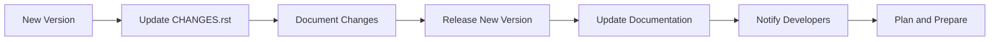
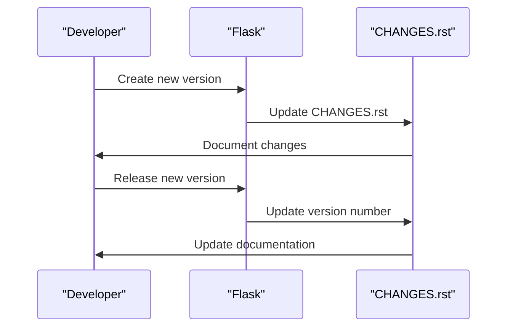

# Release History
## Overview
The release history of Flask is a crucial aspect of understanding the framework's evolution and maintenance. It provides insights into new features, bug fixes, and deprecated code, allowing developers to make informed decisions about their projects. The [CHANGES.rst](CHANGES.rst) file serves as a comprehensive changelog, documenting the changes made to the Flask web framework across various versions. This file is essential for developers who want to stay up-to-date with the latest developments in the framework and plan their projects accordingly.

The release history of Flask is closely tied to its versioning scheme, which follows the semantic versioning guidelines. This means that each version of Flask is associated with a unique version number, which consists of three parts: major, minor, and patch. The major version represents significant changes, the minor version represents new features or enhancements, and the patch version represents bug fixes or minor changes. Understanding the versioning scheme is essential for developers who want to track changes and plan their projects effectively.

## Key Components / Concepts
The release history of Flask involves several key components and concepts, including versioning, changelogs, and deprecation notices. Each version of Flask is associated with a unique version number, which follows the semantic versioning scheme. The [CHANGES.rst](CHANGES.rst) file contains a detailed list of changes, including new features, bug fixes, and deprecated code, for each version of Flask.

Versioning is a critical component of the release history, as it allows developers to track changes and plan their projects effectively. The semantic versioning scheme used by Flask ensures that each version is unique and represents a specific set of changes. The version number is used to identify the version of Flask being used in a project, and it is essential for ensuring compatibility and resolving issues.

Changelogs are another essential component of the release history, as they provide a detailed record of changes made to the framework. The [CHANGES.rst](CHANGES.rst) file is the primary changelog for Flask, and it contains a comprehensive list of changes, including new features, bug fixes, and deprecated code. The changelog is written in reStructuredText format, which allows for easy parsing and rendering of the content.

Deprecation notices are also an essential component of the release history, as they provide warning of upcoming changes or removals. Deprecation notices are used to inform developers of changes that may affect their projects, allowing them to plan and prepare for the changes. The [CHANGES.rst](CHANGES.rst) file contains deprecation notices for each version of Flask, providing developers with essential information for planning and maintaining their projects.

## How it Works
The release history of Flask is maintained through a combination of automated and manual processes. When a new version of Flask is released, the changes are documented in the [CHANGES.rst](CHANGES.rst) file, which is then updated to reflect the new version number and changes. The file is written in reStructuredText format, which allows for easy parsing and rendering of the content.

The process of maintaining the release history involves several steps, including:

1. Creating a new version of Flask: This involves making changes to the codebase, testing the changes, and preparing the release.
2. Documenting changes: This involves updating the [CHANGES.rst](CHANGES.rst) file to reflect the changes made in the new version.
3. Updating the version number: This involves updating the version number in the [CHANGES.rst](CHANGES.rst) file and other relevant files.
4. Releasing the new version: This involves making the new version available to the public, either through a release announcement or by updating the package repositories.
5. Updating documentation: This involves updating the documentation to reflect the changes made in the new version.

The release history is maintained by the Flask development team, who are responsible for ensuring that the [CHANGES.rst](CHANGES.rst) file is up-to-date and accurate. The team uses a combination of automated tools and manual processes to maintain the release history, ensuring that the information is accurate and reliable.

## Example(s)
For example, the [CHANGES.rst](CHANGES.rst) file contains the following entry for version 3.2.0:
```
Version 3.2.0
-------------
Unreleased

-   Drop support for Python 3.9. :pr:`5730`
-   Remove previously deprecated code: ``__version__``. :pr:`5648`
-   ``RequestContext`` has merged with ``AppContext``. ``RequestContext`` is now
    a deprecated alias. If an app context is already pushed, it is not reused
    when dispatching a request. This greatly simplifies the internal code for tracking
    the active context. :issue:`5639`
-   ``template_filter``, ``template_test``, and ``template_global`` decorators
    can be used without parentheses. :issue:`5729`
```
This entry provides a summary of the changes made in version 3.2.0, including the removal of support for Python 3.9 and the deprecation of previously deprecated code.

Another example is the entry for version 2.0.0, which contains the following changes:
```
Version 2.0.0
-------------
Released 2022-06-30

-   Drop support for Python 3.6 and 3.7. :pr:`5141`
-   Remove previously deprecated code: ``url_for`` with ``_external=True``. :pr:`5134`
-   ``url_for`` now raises a ``BuildError`` if the URL cannot be built. :issue:`5123`
-   ``send_file`` now raises a ``FileNotFoundError`` if the file does not exist. :issue:`5119`
```
This entry provides a summary of the changes made in version 2.0.0, including the removal of support for Python 3.6 and 3.7 and the deprecation of previously deprecated code.

## Diagram(s)

This flowchart illustrates the process of maintaining the release history of Flask, from creating a new version to notifying developers and planning for the changes.


This sequence diagram illustrates the interaction between the developer, Flask, and the [CHANGES.rst](CHANGES.rst) file during the release process.

## References
* [CHANGES.rst](CHANGES.rst)
* [tests/test_basic.py](tests/test_basic.py)
* [tests/test_apps/cliapp/message.txt](tests/test_apps/cliapp/message.txt)
* [LICENSE.txt](LICENSE.txt)
* [pyproject.toml](pyproject.toml)