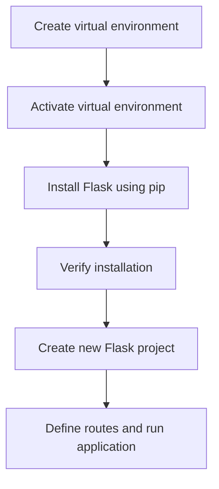

# Installation Guide
## Overview
The installation of Flask is a straightforward process that can be completed using pip, the Python package manager. This guide will walk you through the steps to install Flask, set up a virtual environment, and use the command-line interface (CLI).

## Key Components / Concepts
Before installing Flask, it's essential to understand the key components and concepts involved in the process. These include:
* **Virtual environments**: Virtual environments are self-contained Python environments that allow you to manage dependencies and packages for your project without affecting the system-wide Python environment.
* **pip**: pip is the Python package manager that is used to install packages, including Flask.
* **CLI**: The CLI, or command-line interface, is used to interact with Flask and perform various tasks, such as running the development server and creating new projects.

## How it Works
The installation process involves the following steps:
1. **Create a virtual environment**: Create a new virtual environment using a tool like `python -m venv` or `conda`.
2. **Activate the virtual environment**: Activate the virtual environment using the `source` command (on Linux/Mac) or the `activate` command (on Windows).
3. **Install Flask**: Install Flask using pip by running the command `pip install flask`.
4. **Verify the installation**: Verify that Flask has been installed correctly by running the command `flask --version`.

## Example(s)
Here is an example of how to create a new Flask project:
```python
from flask import Flask
app = Flask(__name__)

@app.route("/")
def hello():
    return "Hello, World!"

if __name__ == "__main__":
    app.run()
```
This code creates a new Flask application and defines a single route for the root URL ("/").

## Diagram(s)

This flowchart illustrates the steps involved in installing Flask and creating a new project.

## References
* `tests/test_apps/cliapp/inner1/inner2/flask.py`: This file demonstrates how to create a Flask application instance.
* `tests/test_cli.py`: This file contains tests for the Flask CLI, including the `test_no_command_echo_loading_error` and `test_help_echo_loading_error` functions.
* `tests/test_apps/blueprintapp/__init__.py`: This file shows how to initialize a Flask application and configure its settings.
* `README.md`: This file provides an overview of Flask and its features.
* `docs/installation.rst`: This file contains detailed instructions for installing Flask.
* `pyproject.toml`: This file is used to manage dependencies and packages for the project.