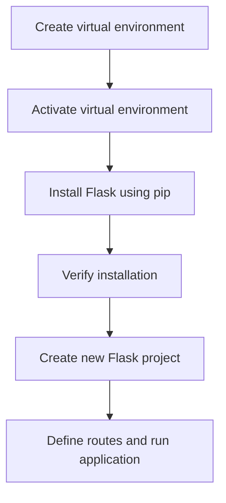

# Installation Guide
## Overview
The installation of Flask is a straightforward process that can be completed using pip, the Python package manager. This guide will walk you through the steps to install Flask, set up a virtual environment, and use the command-line interface (CLI). The process involves creating a virtual environment, activating it, installing Flask using pip, and verifying the installation. Additionally, this guide will cover the key components and concepts involved in the process, including virtual environments, pip, and the CLI.

## Key Components / Concepts
Before installing Flask, it's essential to understand the key components and concepts involved in the process. These include:
* **Virtual environments**: Virtual environments are self-contained Python environments that allow you to manage dependencies and packages for your project without affecting the system-wide Python environment. This is useful for managing different versions of packages and dependencies for different projects.
* **pip**: pip is the Python package manager that is used to install packages, including Flask. pip is the recommended way to install Flask, as it allows you to easily manage dependencies and packages.
* **CLI**: The CLI, or command-line interface, is used to interact with Flask and perform various tasks, such as running the development server and creating new projects. The CLI provides a convenient way to manage your Flask application and perform common tasks.

## How it Works
The installation process involves the following steps:
1. **Create a virtual environment**: Create a new virtual environment using a tool like `python -m venv` or `conda`. This will create a new directory containing the virtual environment, which can be activated to manage dependencies and packages for your project.
2. **Activate the virtual environment**: Activate the virtual environment using the `source` command (on Linux/Mac) or the `activate` command (on Windows). This will update the shell's environment variables to point to the virtual environment, allowing you to manage dependencies and packages for your project.
3. **Install Flask**: Install Flask using pip by running the command `pip install flask`. This will download and install Flask, along with its dependencies, into the virtual environment.
4. **Verify the installation**: Verify that Flask has been installed correctly by running the command `flask --version`. This will display the version of Flask that is installed, confirming that the installation was successful.

## Example(s)
Here is an example of how to create a new Flask project:
```python
from flask import Flask
app = Flask(__name__)

@app.route("/")
def hello():
    return "Hello, World!"

if __name__ == "__main__":
    app.run()
```
This code creates a new Flask application and defines a single route for the root URL ("/"). The `@app.route()` decorator is used to define the route, and the `app.run()` function is used to start the development server.

To run the application, save this code to a file (e.g. `app.py`) and run it using the command `python app.py`. This will start the development server, and you can access the application by navigating to `http://localhost:5000/` in your web browser.

## Diagram(s)

This flowchart illustrates the steps involved in installing Flask and creating a new project. The flowchart shows the sequence of steps, from creating a virtual environment to defining routes and running the application.

## Advanced Topics
In addition to the basic installation process, there are several advanced topics to consider when working with Flask. These include:
* **Configuring the application**: Flask provides several ways to configure the application, including using environment variables, configuration files, and the `app.config` dictionary.
* **Using blueprints**: Blueprints are a way to organize and structure your application, allowing you to break it down into smaller, more manageable pieces.
* **Using extensions**: Flask provides several extensions that can be used to add functionality to your application, including support for databases, authentication, and more.

## Troubleshooting
If you encounter any issues during the installation process, there are several things you can try to troubleshoot the problem. These include:
* **Checking the version of pip**: Make sure you are using the latest version of pip, as older versions may not support the latest features and functionality.
* **Checking the version of Flask**: Make sure you are using the latest version of Flask, as older versions may not support the latest features and functionality.
* **Checking the virtual environment**: Make sure the virtual environment is activated and that the correct version of pip and Flask are being used.

## References
* `tests/test_apps/cliapp/inner1/inner2/flask.py`: This file demonstrates how to create a Flask application instance.
* `tests/test_cli.py`: This file contains tests for the Flask CLI, including the `test_no_command_echo_loading_error` and `test_help_echo_loading_error` functions.
* `tests/test_apps/blueprintapp/__init__.py`: This file shows how to initialize a Flask application and configure its settings.
* `README.md`: This file provides an overview of Flask and its features.
* `docs/installation.rst`: This file contains detailed instructions for installing Flask.