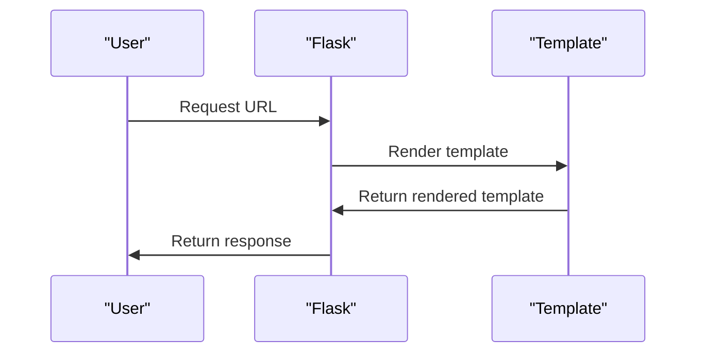

# Installing Flask
## Overview
Flask is a lightweight web application framework designed to make getting started quick and easy, with the ability to scale up to complex applications. It began as a simple wrapper around Werkzeug and Jinja, and has become one of the most popular Python web application frameworks. To install Flask, you will need to have Python and pip installed on your system. Python is a high-level programming language that is easy to learn and understand, while pip is the package installer for Python, which makes it easy to install and manage packages.

The installation process for Flask is straightforward and can be completed in a few steps. First, you need to have Python and pip installed on your system. You can download the latest version of Python from the official Python website and follow the installation instructions. Once Python is installed, you can install pip by running the command `python -m ensurepip` in your terminal or command prompt.

## Key Components / Concepts
The key components of Flask include the Flask application instance, routes, templates, and configuration. The application instance is the core of the Flask application, and is used to configure the application and define routes. Routes are used to map URLs to specific functions in the application, and templates are used to render HTML pages. Configuration is used to customize the behavior of the application.

The Flask application instance is created by instantiating the `Flask` class and passing the name of the current module as an argument. This creates a new instance of the Flask application, which can then be used to configure the application and define routes.

Routes in Flask are used to map URLs to specific functions in the application. This is done using the `@app.route()` decorator, which takes the URL path as an argument and maps it to a specific function. For example, the following code maps the URL `/` to the `index` function:
```python
from flask import Flask
app = Flask(__name__)

@app.route('/')
def index():
    return 'Hello, World!'
```
Templates in Flask are used to render HTML pages. Flask uses the Jinja2 templating engine, which allows you to render dynamic content in your HTML pages. Templates are stored in a separate directory, usually called `templates`, and can be rendered using the `render_template` function.

Configuration in Flask is used to customize the behavior of the application. This can be done using the `config` object, which allows you to set configuration variables. For example, the following code sets the `SECRET_KEY` configuration variable:
```python
app.config['SECRET_KEY'] = 'secret_key'
```
## How it Works
To install Flask, you can use pip, which is the package installer for Python. The installation process involves downloading and installing the Flask package and its dependencies. The dependencies of Flask include blinker, click, itsdangerous, jinja2, markupsafe, and werkzeug.

Once Flask is installed, you can create a new Flask application instance and start building your web application. The following steps outline the process of installing Flask and creating a new Flask application instance:

1. Install Flask using pip: `pip install flask`
2. Create a new Python file, for example `app.py`
3. Import the Flask class and create a new instance of the Flask application: `from flask import Flask; app = Flask(__name__)`
4. Define routes and templates for your application
5. Run the application using `flask run`

## Example(s)
Here is an example of how to install Flask using pip:
```bash
pip install flask
```
Once Flask is installed, you can create a new Flask application instance using the following code:
```python
from flask import Flask
app = Flask(__name__)
```
This code creates a new Flask application instance and assigns it to the variable `app`.

Here is a more complete example of a Flask application:
```python
from flask import Flask, render_template

app = Flask(__name__)

@app.route('/')
def index():
    return render_template('index.html')

if __name__ == '__main__':
    app.run()
```
This code creates a new Flask application instance, defines a route for the URL `/`, and renders an HTML template called `index.html`.

## Diagram(s)
```mermaid
flowchart
    participant User as "User"
    participant Pip as "Pip"
    participant Flask as "Flask"
    participant Dependencies as "Dependencies"

    User->>Pip: Install Flask
    Pip->>Flask: Download and install Flask
    Pip->>Dependencies: Download and install dependencies
    Flask->>User: Create new Flask application instance
```
This diagram shows the process of installing Flask using pip, and creating a new Flask application instance.


This diagram shows the process of rendering a template in Flask.

## References
* [pyproject.toml](pyproject.toml)
* [tests/test_config.py](tests/test_config.py)
* [tests/test_apps/.flaskenv](tests/test_apps/.flaskenv)
* [README.md](README.md)
* [docs/installation.rst](docs/installation.rst)