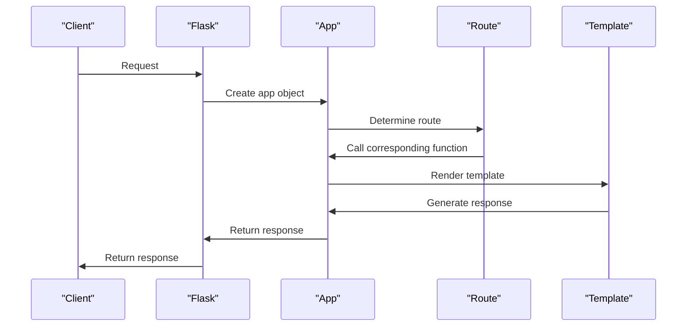

# Core Package Structure
## Overview
The core package structure of Flask is designed to be lightweight and flexible, making it easy to get started with building web applications. At its core, Flask is a microframework that provides a basic structure for building web applications, while allowing developers to choose their own tools and libraries. The package structure is organized in a way that makes it easy to navigate and understand, with a focus on simplicity and ease of use. This structure is reflected in the way the framework is modularized, with each module having a specific responsibility, such as handling requests, rendering templates, and managing routes.

The core package structure of Flask is composed of several key modules, including `flask`, `flask.app`, `flask.routing`, and `flask.template`. These modules work together to provide the core functionality of the framework, including support for routes, templates, and blueprints. The `flask` module is the main entry point for the framework, and it provides the `Flask` class, which is the core of the framework.

## Key Components / Concepts
The core package structure of Flask includes several key components and concepts, including:
* The `Flask` class, which is the core of the framework and provides the basic structure for building web applications. The `Flask` class is responsible for managing the application's configuration, routes, and templates.
* The `app` object, which is an instance of the `Flask` class and is used to configure and run the application. The `app` object is the central component of a Flask application, and it provides access to the application's configuration, routes, and templates.
* Blueprints, which are a way to organize and structure the application into smaller, reusable components. Blueprints are used to group related routes, templates, and other application logic together, making it easier to build and maintain complex applications.
* Routes, which are used to map URLs to specific functions or methods in the application. Routes are a key component of a Flask application, and they are used to handle requests and return responses to the client.
* Templates, which are used to render dynamic content in the application. Templates are a key component of a Flask application, and they are used to generate HTML responses to the client.

In addition to these key components, the core package structure of Flask also includes several other important concepts, such as:
* Request and response objects, which are used to handle requests and return responses to the client. The request object provides access to the request's data, such as the URL, headers, and body, while the response object provides access to the response's data, such as the status code, headers, and body.
* Session objects, which are used to store data that needs to be preserved across requests. Session objects are a key component of a Flask application, and they are used to store data such as user authentication information and shopping cart contents.
* Configuration objects, which are used to manage the application's configuration. Configuration objects are a key component of a Flask application, and they are used to store data such as database connections and API keys.

## How it Works
The core package structure of Flask works by providing a basic structure for building web applications, while allowing developers to choose their own tools and libraries. The `Flask` class provides the core functionality of the framework, including support for routes, templates, and blueprints. The `app` object is used to configure and run the application, and is typically created by instantiating the `Flask` class.

When a request is made to the application, Flask uses the routes to determine which function or method to call, and then renders the corresponding template to generate the response. Blueprints are used to organize and structure the application into smaller, reusable components, making it easier to build and maintain complex applications.

Here is a step-by-step overview of how the core package structure of Flask works:
1. The client makes a request to the application.
2. The request is received by the `app` object, which uses the routes to determine which function or method to call.
3. The `app` object calls the corresponding function or method, passing in the request object as an argument.
4. The function or method processes the request, using the request object to access the request's data.
5. The function or method returns a response object, which is used to generate the response to the client.
6. The `app` object uses the response object to generate the response to the client, including setting the status code, headers, and body.
7. The response is returned to the client, completing the request-response cycle.

## Example(s)
Here is an example of a simple Flask application:
```python
from flask import Flask

app = Flask(__name__)

@app.route("/")
def hello():
    return "Hello, World!"

if __name__ == "__main__":
    app.run()
```
This example creates a simple Flask application with a single route that returns the string "Hello, World!".

Here is a more complex example that demonstrates the use of blueprints and templates:
```python
from flask import Flask, render_template

app = Flask(__name__)

@app.route("/")
def index():
    return render_template("index.html")

@app.route("/about")
def about():
    return render_template("about.html")

if __name__ == "__main__":
    app.run()
```
This example creates a Flask application with two routes, one for the index page and one for the about page. The `render_template` function is used to render the corresponding template for each route.

## Diagram(s)
```mermaid
flowchart
    participant Client as "Client"
    participant Flask as "Flask"
    participant Route as "Route"
    participant Template as "Template"

    Client->>Flask: Request
    Flask->>Route: Determine route
    Route->>Flask: Call corresponding function
    Flask->>Template: Render template
    Template->>Flask: Generate response
    Flask->>Client: Return response
```
This diagram shows the basic flow of a request through a Flask application, from the client making the request to the application returning the response.


This diagram shows the sequence of events that occurs when a request is made to a Flask application, including the creation of the app object, the determination of the route, the rendering of the template, and the generation of the response.

## References
* `tests/test_apps/cliapp/inner1/inner2/flask.py`: This file demonstrates how to create a Flask application instance and define routes.
* `tests/test_apps/subdomaintestmodule/__init__.py`: This file shows how to initialize a Flask module with a subdomain.
* `tests/test_apps/cliapp/inner1/__init__.py`: This file demonstrates how to initialize a Flask web application.
* `src/flask/__init__.py`: This file contains the core functionality of the Flask framework.
* `src/flask/app.py`: This file contains the `Flask` class, which is the core of the framework.