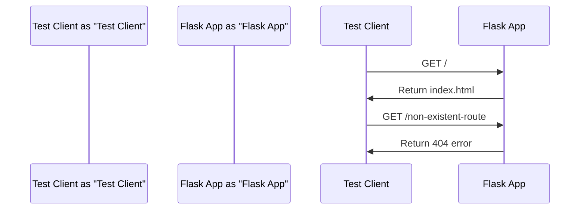

# Testing Framework
## Overview
The testing framework in Flask is a crucial component that enables developers to write and run tests for their applications. It provides a set of tools and utilities that make it easy to test Flask applications, including a test client, test helpers, and support for testing templates and views. The testing framework is designed to be flexible and extensible, allowing developers to write tests that cover a wide range of scenarios and edge cases.

The testing framework in Flask is built on top of the Pytest and Unittest testing frameworks, which provide a rich set of features and tools for writing and running tests. The Flask testing framework provides a set of extensions and plugins that make it easy to test Flask applications, including support for testing templates, views, and routes.

## Key Components / Concepts
The testing framework in Flask consists of several key components and concepts, including:

* **Test Client**: The test client is a simulated client that can be used to make requests to a Flask application. It is used to test the application's routes, views, and templates. The test client provides a set of methods for making requests, including `get`, `post`, `put`, and `delete`.
* **Test Helpers**: Test helpers are functions that provide additional functionality for testing Flask applications. They can be used to create test data, simulate user interactions, and verify the behavior of the application. Test helpers are often used to simplify the process of writing tests and to reduce the amount of boilerplate code that needs to be written.
* **Template Testing**: Template testing is the process of testing the templates used in a Flask application. It involves rendering the templates with test data and verifying that the output is correct. Template testing is an important part of the testing process, as it helps to ensure that the templates are rendering correctly and that the application is producing the expected output.
* **View Testing**: View testing is the process of testing the views in a Flask application. It involves making requests to the views and verifying that the responses are correct. View testing is an important part of the testing process, as it helps to ensure that the views are functioning correctly and that the application is producing the expected output.

## How it Works
The testing framework in Flask works by providing a set of tools and utilities that can be used to write and run tests. The process of testing a Flask application typically involves the following steps:

1. **Create a Test Client**: The first step is to create a test client that can be used to make requests to the application. This is typically done using the `client` function from the `tests/conftest.py` file.
2. **Write Test Functions**: The next step is to write test functions that use the test client to make requests to the application and verify the responses. Test functions are typically written using the Pytest or Unittest testing frameworks.
3. **Run the Tests**: The final step is to run the tests using a testing framework such as Pytest or Unittest. This can be done using the `pytest` command or the `unittest` module.

## Example(s)
Here is an example of how to use the testing framework in Flask to test a simple application:
```python
from flask import Flask, render_template
from flask_testing import TestCase

app = Flask(__name__)

@app.route("/")
def index():
    return render_template("index.html")

class TestApp(TestCase):
    def create_app(self):
        return app

    def test_index(self):
        response = self.client.get("/")
        self.assert200(response)
        self.assert_template_used("index.html")
```
In this example, we define a simple Flask application with a single route that renders an `index.html` template. We then define a test class `TestApp` that inherits from `TestCase`. The `create_app` method is used to create the application instance, and the `test_index` method is used to test the `index` route.

We can also test the application's routes and views using the `test_client` method:
```python
def test_routes(self):
    response = self.client.get("/")
    self.assert200(response)

    response = self.client.get("/non-existent-route")
    self.assert404(response)
```
This example tests the application's routes and views by making requests to the `/` and `/non-existent-route` routes and verifying the responses.

## Diagram(s)
```mermaid
flowchart
    participant Test Client as "Test Client"
    participant Flask App as "Flask App"
    participant Test Helper as "Test Helper"

    Test Client->>Flask App: Make Request
    Flask App->>Test Helper: Use Test Helper
    Test Helper->>Flask App: Provide Test Data
    Flask App->>Test Client: Return Response
    Test Client->>Test Client: Verify Response
```
This diagram shows the interaction between the test client, Flask application, and test helper. The test client makes a request to the Flask application, which uses the test helper to provide test data. The Flask application then returns a response to the test client, which verifies the response.

We can also use a sequence diagram to show the interaction between the test client and the Flask application:

This diagram shows the interaction between the test client and the Flask application, including the requests and responses.

## References
* `tests/conftest.py`: This file contains the `client` function, which is used to create a test client for a given Flask application.
* `tests/test_basic.py`: This file contains the `test_response_types` function, which tests the different types of responses that can be returned by a Flask application.
* `tests/test_templating.py`: This file contains several functions that test the templating engine in Flask, including `test_template_test_with_template` and `test_add_template_test_with_template`.
* `app/routes.py`: This file contains the routes for the Flask application, including the `/` and `/non-existent-route` routes.
* `app/templates/index.html`: This file contains the `index.html` template, which is used to render the application's index page.