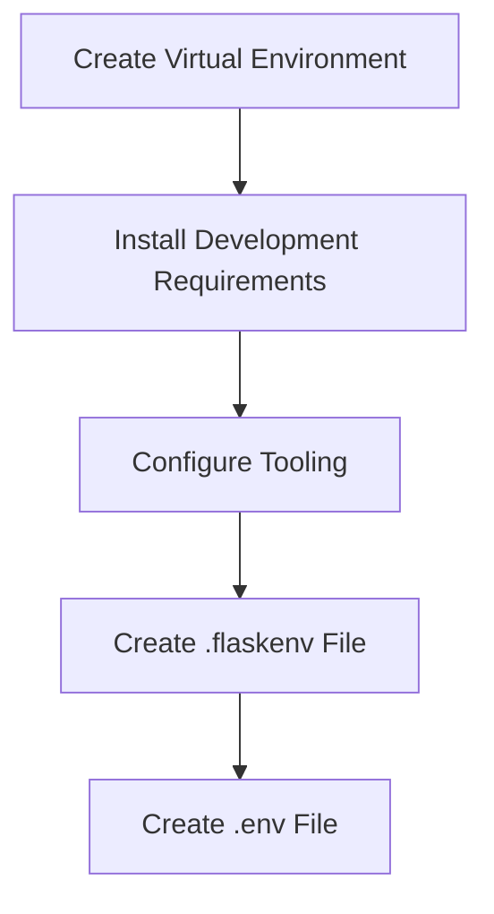

# Setting Up Development Environment
## Overview
Setting up a development environment for a Flask application involves several steps, including creating a virtual environment, installing development requirements, and configuring tooling. This process is crucial for ensuring that the application is developed and tested in a consistent and reliable manner.

## Key Components / Concepts
The key components involved in setting up a development environment for a Flask application include:
* Virtual environments: These are self-contained Python environments that allow developers to isolate their application's dependencies and ensure that they do not conflict with other projects.
* Development requirements: These are the dependencies required to develop and test the application, such as Flask, Werkzeug, and other libraries.
* Tooling: This includes tools such as debuggers, testers, and linters that help developers to identify and fix issues in their code.

## How it Works
The process of setting up a development environment for a Flask application typically involves the following steps:
1. Creating a virtual environment using a tool such as `venv` or `conda`.
2. Installing the development requirements using `pip` or another package manager.
3. Configuring the tooling, such as setting up a debugger or tester.
4. Creating a `.flaskenv` file to store environment variables for the application.
5. Creating a `.env` file to store environment variables for the application.

## Example(s)
For example, to create a virtual environment and install the development requirements, you can use the following commands:
```bash
python -m venv myenv
source myenv/bin/activate
pip install flask werkzeug
```
To configure the tooling, you can use a debugger such as `pdb` or a tester such as `pytest`.

## Diagram(s)

This flowchart illustrates the steps involved in setting up a development environment for a Flask application.

## References
* `tests/test_cli.py`: This file contains functions for testing the command-line interface of a Flask application, including the `test_dotenv_path` function.
* `tests/test_testing.py`: This file contains functions for testing the testing framework of a Flask application, including the `test_environ_base_default` function.
* `tests/test_apps/.flaskenv`: This file contains environment variables for a Flask application, including the `FOO` and `BAR` variables.
* `tests/test_apps/.env`: This file contains environment variables for a Flask application, including the `FOO` and `SPAM` variables.
* `pyproject.toml`: This file contains configuration for a Python project, including the dependencies and build settings.