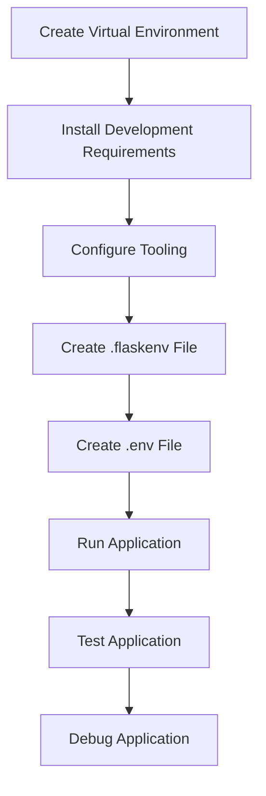

# Setting Up Development Environment
## Overview
Setting up a development environment for a Flask application involves several steps, including creating a virtual environment, installing development requirements, and configuring tooling. This process is crucial for ensuring that the application is developed and tested in a consistent and reliable manner. A well-configured development environment helps developers to identify and fix issues in their code, ensuring that the application is stable, secure, and performs well.

The development environment for a Flask application typically consists of a virtual environment, development requirements, and tooling. The virtual environment provides a self-contained Python environment that allows developers to isolate their application's dependencies and ensure that they do not conflict with other projects. The development requirements include the dependencies required to develop and test the application, such as Flask, Werkzeug, and other libraries. The tooling includes tools such as debuggers, testers, and linters that help developers to identify and fix issues in their code.

## Key Components / Concepts
The key components involved in setting up a development environment for a Flask application include:
* Virtual environments: These are self-contained Python environments that allow developers to isolate their application's dependencies and ensure that they do not conflict with other projects. Virtual environments can be created using tools such as `venv` or `conda`.
* Development requirements: These are the dependencies required to develop and test the application, such as Flask, Werkzeug, and other libraries. The development requirements are typically installed using `pip` or another package manager.
* Tooling: This includes tools such as debuggers, testers, and linters that help developers to identify and fix issues in their code. Examples of tooling include `pdb` for debugging, `pytest` for testing, and `flake8` for linting.
* Environment variables: These are variables that are used to configure the application and are typically stored in a `.flaskenv` or `.env` file. Environment variables can be used to store sensitive information such as database credentials or API keys.

## How it Works
The process of setting up a development environment for a Flask application typically involves the following steps:
1. Creating a virtual environment using a tool such as `venv` or `conda`. This involves running a command such as `python -m venv myenv` to create a new virtual environment.
2. Installing the development requirements using `pip` or another package manager. This involves running a command such as `pip install flask werkzeug` to install the required dependencies.
3. Configuring the tooling, such as setting up a debugger or tester. This involves installing the required tooling and configuring it to work with the application.
4. Creating a `.flaskenv` file to store environment variables for the application. This involves creating a new file and adding the required environment variables, such as `FLASK_APP` and `FLASK_ENV`.
5. Creating a `.env` file to store environment variables for the application. This involves creating a new file and adding the required environment variables, such as `DATABASE_URL` and `SECRET_KEY`.

## Example(s)
For example, to create a virtual environment and install the development requirements, you can use the following commands:
```bash
python -m venv myenv
source myenv/bin/activate
pip install flask werkzeug
```
To configure the tooling, you can use a debugger such as `pdb` or a tester such as `pytest`. For example, you can install `pytest` using the following command:
```bash
pip install pytest
```
You can then run the tests using the following command:
```bash
pytest
```
To create a `.flaskenv` file, you can use the following example:
```makefile
FLASK_APP=myapp
FLASK_ENV=development
```
To create a `.env` file, you can use the following example:
```makefile
DATABASE_URL=sqlite:///mydb.db
SECRET_KEY=mysecretkey
```
## Diagram(s)

This flowchart illustrates the steps involved in setting up a development environment for a Flask application, including creating a virtual environment, installing development requirements, configuring tooling, creating environment variables, running the application, testing the application, and debugging the application.

## References
* `tests/test_cli.py`: This file contains functions for testing the command-line interface of a Flask application, including the `test_dotenv_path` function.
* `tests/test_testing.py`: This file contains functions for testing the testing framework of a Flask application, including the `test_environ_base_default` function.
* `tests/test_apps/.flaskenv`: This file contains environment variables for a Flask application, including the `FOO` and `BAR` variables.
* `tests/test_apps/.env`: This file contains environment variables for a Flask application, including the `FOO` and `SPAM` variables.
* `pyproject.toml`: This file contains configuration for a Python project, including the dependencies and build settings.