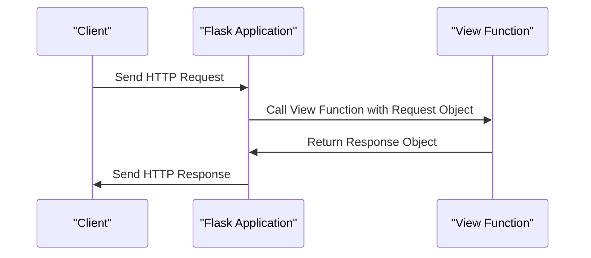

# Request and Response Objects
## Overview
Request and response objects are fundamental components in Flask, a micro web framework written in Python. They represent the incoming request from the client and the outgoing response from the server, respectively. Understanding these objects is crucial for building robust and efficient web applications.

## Key Components / Concepts
The request object, typically accessed through `flask.request`, contains information about the incoming request, such as the HTTP method, path, query parameters, and body data. On the other hand, the response object, often created using `flask.Response` or `flask.make_response`, encapsulates the data sent back to the client, including the HTTP status code, headers, and response body.

## How it Works
When a client sends an HTTP request to a Flask application, the framework creates a request object based on the incoming request data. This object is then passed to the appropriate view function, which processes the request and returns a response object. The response object is subsequently used by Flask to generate the HTTP response sent back to the client.

## Example(s)
Consider a simple "Hello, World!" example:
```python
from flask import Flask, Response

app = Flask(__name__)

@app.route("/")
def hello_world():
    return Response("Hello, World!", status=200)
```
In this example, the `hello_world` view function returns a `Response` object with the string "Hello, World!" as its body and an HTTP status code of 200 (OK).

## Diagram(s)

This sequence diagram illustrates the flow of a request and response in a Flask application.

## References
* `tests/test_views.py`: This file contains examples of view functions that return different types of responses, such as strings and `Response` objects.
* `tests/test_basic.py`: This file includes tests for various response types, including tuples, dictionaries, and lists.
* `tests/test_appctx.py`: This file contains tests for application context-related functionality, including URL generation and server name matching.
* `tests/test_reqctx.py`: This file includes tests for request context-related functionality, such as accessing request data and manipulating the request object.
* `tests/test_request.py`: This file contains tests for request-related functionality, including parsing query parameters and handling request body data.