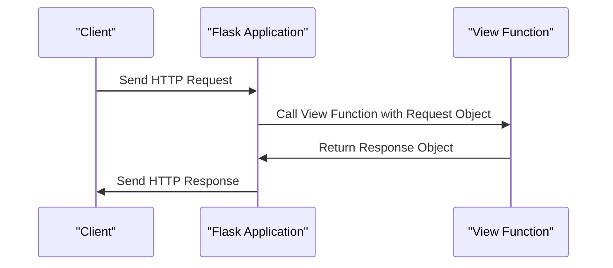

# Request and Response Objects
## Overview
Request and response objects are fundamental components in Flask, a micro web framework written in Python. They represent the incoming request from the client and the outgoing response from the server, respectively. Understanding these objects is crucial for building robust and efficient web applications. The request object provides a way to access information about the incoming request, such as the HTTP method, path, query parameters, and body data. On the other hand, the response object encapsulates the data sent back to the client, including the HTTP status code, headers, and response body.

In Flask, the request object is typically accessed through `flask.request`, while the response object is often created using `flask.Response` or `flask.make_response`. These objects play a vital role in the request-response cycle of a Flask application. By leveraging the request object, developers can extract relevant information from the incoming request and use it to determine the appropriate response. The response object, in turn, allows developers to craft a response that meets the needs of the client, including setting the HTTP status code, headers, and response body.

## Key Components / Concepts
The request object contains several key attributes and methods that provide access to information about the incoming request. Some of the most commonly used attributes include:

* `method`: The HTTP method used to make the request (e.g., GET, POST, PUT, DELETE).
* `path`: The path of the request (e.g., `/users`, `/products`).
* `args`: A dictionary-like object containing the query parameters of the request.
* `form`: A dictionary-like object containing the form data of the request.
* `json`: A dictionary-like object containing the JSON data of the request.

In addition to these attributes, the request object also provides several methods for working with the request data, such as `get_json()` and `get_data()`.

The response object, on the other hand, provides a way to craft a response that meets the needs of the client. Some of the most commonly used attributes and methods include:

* `status_code`: The HTTP status code of the response (e.g., 200, 404, 500).
* `headers`: A dictionary-like object containing the headers of the response.
* `response`: The response body of the response.
* `set_cookie()`: A method for setting cookies in the response.
* `delete_cookie()`: A method for deleting cookies in the response.

By leveraging these attributes and methods, developers can create responses that are tailored to the needs of the client.

## How it Works
When a client sends an HTTP request to a Flask application, the framework creates a request object based on the incoming request data. This object is then passed to the appropriate view function, which processes the request and returns a response object. The response object is subsequently used by Flask to generate the HTTP response sent back to the client.

Here is a high-level overview of the request-response cycle in Flask:

1. The client sends an HTTP request to the Flask application.
2. Flask creates a request object based on the incoming request data.
3. The request object is passed to the appropriate view function.
4. The view function processes the request and returns a response object.
5. The response object is used by Flask to generate the HTTP response sent back to the client.

## Example(s)
Consider a simple "Hello, World!" example:
```python
from flask import Flask, Response

app = Flask(__name__)

@app.route("/")
def hello_world():
    return Response("Hello, World!", status=200)
```
In this example, the `hello_world` view function returns a `Response` object with the string "Hello, World!" as its body and an HTTP status code of 200 (OK).

Another example might involve returning a JSON response:
```python
from flask import Flask, jsonify

app = Flask(__name__)

@app.route("/users")
def get_users():
    users = [{"id": 1, "name": "John Doe"}, {"id": 2, "name": "Jane Doe"}]
    return jsonify(users)
```
In this example, the `get_users` view function returns a JSON response containing a list of users.

## Diagram(s)

This sequence diagram illustrates the flow of a request and response in a Flask application.

Additionally, the following flowchart provides a more detailed overview of the request-response cycle:
```mermaid
flowchart LR
    A[Client Sends HTTP Request] -->|Request Object Created|> B[Flask Application]
    B -->|Request Object Passed to View Function|> C[View Function]
    C -->|Response Object Returned|> D[Flask Application]
    D -->|HTTP Response Sent to Client|> E[Client]
```
This flowchart highlights the key steps involved in the request-response cycle, including the creation of the request object, the passing of the request object to the view function, and the return of the response object.

## References
* `tests/test_views.py`: This file contains examples of view functions that return different types of responses, such as strings and `Response` objects.
* `tests/test_basic.py`: This file includes tests for various response types, including tuples, dictionaries, and lists.
* `tests/test_appctx.py`: This file contains tests for application context-related functionality, including URL generation and server name matching.
* `tests/test_reqctx.py`: This file includes tests for request context-related functionality, such as accessing request data and manipulating the request object.
* `tests/test_request.py`: This file contains tests for request-related functionality, including parsing query parameters and handling request body data.