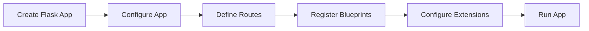

# Flask Application Object
## Overview
The Flask application object is the core of the Flask web framework. It represents the web application and provides a central location for configuration, routing, and other application-related tasks. The application object is an instance of the `Flask` class, which is a subclass of the `flask.Flask` class.

## Key Components / Concepts
The Flask application object has several key components and concepts that are essential to understanding how it works. These include:

* **Configuration**: The application object has a configuration object that stores settings and options for the application. This configuration object is an instance of the `Config` class.
* **Routing**: The application object provides a routing system that maps URLs to application endpoints. This is done using the `@app.route()` decorator.
* **Blueprints**: The application object supports blueprints, which are a way to organize and structure the application into smaller, reusable components.
* **Extensions**: The application object can be extended with third-party extensions, which provide additional functionality and features.

## How it Works
The Flask application object works by creating an instance of the `Flask` class and configuring it with the application's settings and options. The application object is then used to define routes, register blueprints, and configure extensions.

The application object has several methods and attributes that are used to configure and customize the application. These include:

* **`__init__`**: The constructor method that initializes the application object.
* **`config`**: The configuration object that stores settings and options for the application.
* **`route`**: The method that maps URLs to application endpoints.
* **`register_blueprint`**: The method that registers a blueprint with the application.

## Example(s)
Here is an example of creating a simple Flask application:
```python
from flask import Flask

app = Flask(__name__)

@app.route("/")
def hello():
    return "Hello, World!"
```
This example creates a Flask application object and defines a single route that maps the URL `/` to the `hello` function.

## Diagram(s)

This diagram shows the basic flow of creating and configuring a Flask application.

## References
* `tests/test_config.py`: This file contains an example of a Flask application class that subclasses the `flask.Flask` class.
* `tests/test_apps/cliapp/inner1/__init__.py`: This file contains an example of a Flask application object that is created and configured in the `__init__.py` file.
* `tests/test_apps/cliapp/inner1/inner2/flask.py`: This file contains an example of a Flask application object that is created and configured in a separate file.
* `src/flask/app.py`: This file contains the implementation of the `Flask` class, which is the core of the Flask web framework.
* `src/flask/sansio/app.py`: This file contains an example of a Flask application object that is created and configured using the `sansio` library.