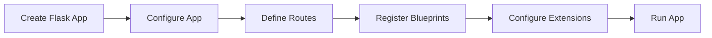
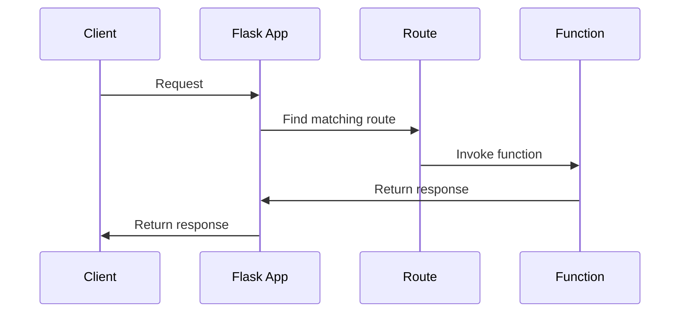

# Flask Application Object
## Overview
The Flask application object is the central component of the Flask web framework, representing the web application and providing a unified location for configuration, routing, and other application-related tasks. The application object is an instance of the `Flask` class, which is a subclass of the `flask.Flask` class. This class is responsible for managing the application's lifecycle, handling requests and responses, and providing a flexible framework for building web applications.

The Flask application object is created by instantiating the `Flask` class, passing the application's name and other configuration options as arguments. This object serves as the core of the application, providing a central location for configuring the application, defining routes, registering blueprints, and configuring extensions.

## Key Components / Concepts
The Flask application object has several key components and concepts that are essential to understanding how it works. These include:

* **Configuration**: The application object has a configuration object that stores settings and options for the application. This configuration object is an instance of the `Config` class, which provides a dictionary-like interface for accessing and modifying configuration values. The configuration object is used to store settings such as the application's name, debug mode, and database connections.
* **Routing**: The application object provides a routing system that maps URLs to application endpoints. This is done using the `@app.route()` decorator, which associates a URL pattern with a specific function or method. The routing system is responsible for handling incoming requests, parsing the URL, and invoking the corresponding function or method.
* **Blueprints**: The application object supports blueprints, which are a way to organize and structure the application into smaller, reusable components. Blueprints are essentially self-contained applications that can be registered with the main application, providing a flexible way to modularize the application and promote code reuse.
* **Extensions**: The application object can be extended with third-party extensions, which provide additional functionality and features. Extensions can be used to add support for databases, authentication, caching, and other features that are not included in the core Flask framework.

## How it Works
The Flask application object works by creating an instance of the `Flask` class and configuring it with the application's settings and options. The application object is then used to define routes, register blueprints, and configure extensions.

The application object has several methods and attributes that are used to configure and customize the application. These include:

* **`__init__`**: The constructor method that initializes the application object, setting the application's name, configuration, and other options.
* **`config`**: The configuration object that stores settings and options for the application, providing a dictionary-like interface for accessing and modifying configuration values.
* **`route`**: The method that maps URLs to application endpoints, using the `@app.route()` decorator to associate a URL pattern with a specific function or method.
* **`register_blueprint`**: The method that registers a blueprint with the application, allowing the blueprint to be used as a self-contained component of the main application.

When a request is received, the application object uses the routing system to determine which function or method should be invoked to handle the request. The application object then invokes the corresponding function or method, passing any relevant arguments and parameters.

## Example(s)
Here is an example of creating a simple Flask application:
```python
from flask import Flask

app = Flask(__name__)

@app.route("/")
def hello():
    return "Hello, World!"
```
This example creates a Flask application object and defines a single route that maps the URL `/` to the `hello` function. When a request is received for the `/` URL, the `hello` function is invoked, returning the string "Hello, World!".

Here is another example that demonstrates the use of blueprints:
```python
from flask import Flask, Blueprint

app = Flask(__name__)

bp = Blueprint("my_blueprint", __name__)

@bp.route("/my_blueprint")
def my_blueprint():
    return "Hello from my blueprint!"

app.register_blueprint(bp)
```
This example creates a Flask application object and defines a blueprint called `my_blueprint`. The blueprint is then registered with the main application using the `register_blueprint` method. When a request is received for the `/my_blueprint` URL, the `my_blueprint` function is invoked, returning the string "Hello from my blueprint!".

## Diagram(s)

This diagram shows the basic flow of creating and configuring a Flask application.


This sequence diagram shows the flow of a request through the Flask application, from the client's initial request to the application's response.

## References
* `tests/test_config.py`: This file contains an example of a Flask application class that subclasses the `flask.Flask` class.
* `tests/test_apps/cliapp/inner1/__init__.py`: This file contains an example of a Flask application object that is created and configured in the `__init__.py` file.
* `tests/test_apps/cliapp/inner1/inner2/flask.py`: This file contains an example of a Flask application object that is created and configured in a separate file.
* `src/flask/app.py`: This file contains the implementation of the `Flask` class, which is the core of the Flask web framework.
* `src/flask/sansio/app.py`: This file contains an example of a Flask application object that is created and configured using the `sansio` library.