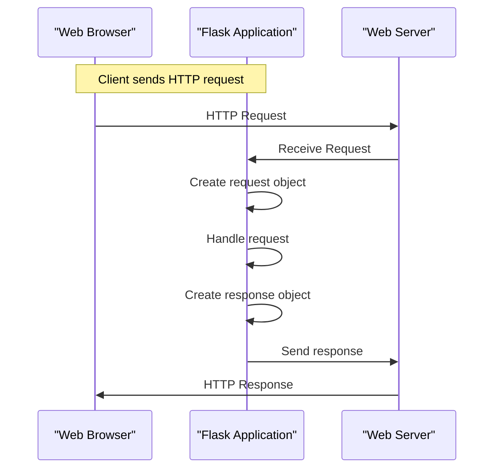

# Request and Response Objects
## Overview
Request and response objects are fundamental components in Flask, a micro web framework written in Python. They represent the HTTP requests sent by clients and the responses sent back by the server.

## Key Components / Concepts
The request object, typically accessed through `flask.request`, contains information about the incoming request, such as the method (GET, POST, etc.), the URL, headers, and any data sent with the request. The response object, which can be created using `flask.Response` or `flask.make_response`, encapsulates the data and metadata to be sent back to the client, including the status code, headers, and response body.

## How it Works
When a client (like a web browser) sends an HTTP request to a Flask application, Flask creates a request object based on the incoming request. The application can then access and manipulate this request object to handle the request appropriately. To send data back to the client, the application creates a response object, which Flask uses to construct the HTTP response.

## Example(s)
For example, a simple "Hello, World!" application might look like this:
```python
from flask import Flask, Response

app = Flask(__name__)

@app.route('/')
def hello_world():
    return Response("Hello, World!", status=200)
```
This example creates a response object with the string "Hello, World!" and a status code of 200 (OK).

## Diagram(s)

This sequence diagram illustrates the basic flow of an HTTP request and response in a Flask application.

## References
- `tests/test_basic.py`
- `tests/test_views.py`
- `tests/test_blueprints.py`