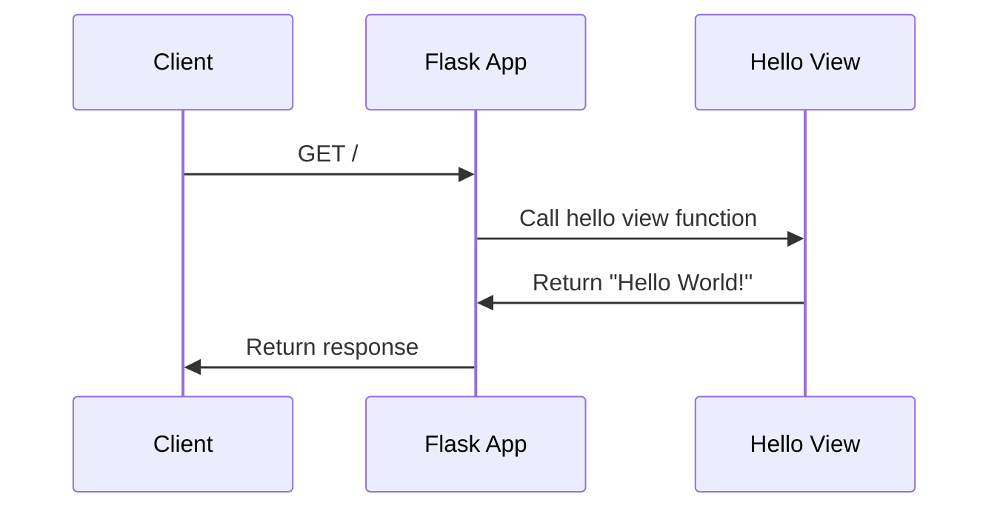

# Example Applications
## Overview
The Flask repository includes several example applications that demonstrate how to use the framework to build web applications. These examples range from simple "Hello World" applications to more complex applications that use blueprints and templates. In this section, we will explore two of these example applications: `helloworld` and `blueprintapp`. The `helloworld` application is a minimal Flask application that serves a single route at "/", while the `blueprintapp` application is a more complex example that uses blueprints to organize its routes and view functions.

The example applications are located in the `tests/test_apps` directory of the Flask repository. The `helloworld` application is defined in the `tests/test_apps/helloworld` directory, and the `blueprintapp` application is defined in the `tests/test_apps/blueprintapp` directory. These applications are fully functional and can be run using the `flask run` command.

## Key Components / Concepts
The `helloworld` application is a minimal Flask application that serves a single route at "/". When a client accesses this endpoint, the `hello` view function returns the plain-text response "Hello World!". This application demonstrates the basic structure of a Flask application, including the creation of a Flask instance and the definition of a route. The `helloworld` application uses the `@app.route` decorator to define the route, and the `hello` view function is called when the route is accessed.

The `blueprintapp` application is a more complex example that uses blueprints to organize its routes and view functions. A blueprint is a way to group related routes and view functions together, making it easier to manage large applications. In `blueprintapp`, we define two blueprints: `admin` and `frontend`. Each blueprint has its own set of routes and view functions, and we register them with the main Flask application instance using the `app.register_blueprint` method. This allows us to organize our routes and view functions in a logical and modular way.

Blueprints are a powerful feature in Flask that allow us to structure our applications in a modular way. They are useful for large applications where we need to organize our routes and view functions into separate modules. Blueprints can also be used to create reusable components that can be used across multiple applications.

## How it Works
To understand how these example applications work, let's take a closer look at the code. In `helloworld`, we create a Flask instance and define a single route at "/" using the `@app.route` decorator. When a client accesses this endpoint, the `hello` view function is called, and it returns the plain-text response "Hello World!". The `helloworld` application uses the `Flask` class to create a new Flask instance, and the `@app.route` decorator to define the route.

In `blueprintapp`, we define two blueprints: `admin` and `frontend`. Each blueprint has its own set of routes and view functions, and we register them with the main Flask application instance using the `app.register_blueprint` method. This allows us to organize our routes and view functions in a logical and modular way. The `blueprintapp` application uses the `Blueprint` class to create new blueprints, and the `app.register_blueprint` method to register the blueprints with the main Flask instance.

The `blueprintapp` application also uses the `url_prefix` parameter to specify a URL prefix for each blueprint. This allows us to organize our routes into separate modules and avoid naming conflicts. For example, the `admin` blueprint has a URL prefix of `/admin`, and the `frontend` blueprint has a URL prefix of `/frontend`.

## Example(s)
Let's take a closer look at the code for `helloworld` and `blueprintapp`. In `helloworld`, we have the following code:
```python
from flask import Flask

app = Flask(__name__)

@app.route("/")
def hello():
    return "Hello World!"
```
This code creates a new Flask instance and defines a single route at "/" using the `@app.route` decorator. When a client accesses this endpoint, the `hello` view function is called, and it returns the plain-text response "Hello World!".

In `blueprintapp`, we have the following code:
```python
from flask import Flask

app = Flask(__name__)
app.config["DEBUG"] = True

from blueprintapp.apps.admin import admin
from blueprintapp.apps.frontend import frontend

app.register_blueprint(admin)
app.register_blueprint(frontend)
```
This code creates a new Flask instance and defines two blueprints: `admin` and `frontend`. Each blueprint has its own set of routes and view functions, and we register them with the main Flask application instance using the `app.register_blueprint` method.

We can also use the `url_for` function to generate URLs for our routes. For example, we can use the `url_for` function to generate a URL for the `hello` view function in the `helloworld` application:
```python
from flask import url_for

@app.route("/")
def hello():
    return "Hello World!"

print(url_for("hello"))
```
This code generates a URL for the `hello` view function and prints it to the console.

## Diagram(s)
Here is a Mermaid diagram that shows the structure of the `blueprintapp` application:
```mermaid
flowchart LR
    A[Flask App] -->|register_blueprint|> B[Admin Blueprint]
    A -->|register_blueprint|> C[Frontend Blueprint]
    B -->|route|> D[/admin]
    C -->|route|> E[/frontend]
    B -->|route|> F[/admin/dashboard]
    C -->|route|> G[/frontend/home]
```
This diagram shows how the `blueprintapp` application is structured, with the main Flask instance registering two blueprints: `admin` and `frontend`. Each blueprint has its own set of routes, which are registered with the main Flask instance. The `admin` blueprint has a route at `/admin`, and the `frontend` blueprint has a route at `/frontend`. The `admin` blueprint also has a route at `/admin/dashboard`, and the `frontend` blueprint has a route at `/frontend/home`.

We can also use Mermaid diagrams to show the flow of requests through our application. For example, we can use a Mermaid diagram to show the flow of requests through the `helloworld` application:

This diagram shows the flow of requests through the `helloworld` application, from the client's initial GET request to the final response returned by the Flask application.

## References
* `tests/test_apps/helloworld/hello.py`: This file defines the `helloworld` application, a minimal Flask application that serves a single route at "/".
* `tests/test_apps/blueprintapp/__init__.py`: This file defines the `blueprintapp` application, a more complex example that uses blueprints to organize its routes and view functions.
* `README.md`: This file provides an overview of the Flask framework and its features.
* `tests/test_blueprints.py`: This file provides examples of how to use blueprints in Flask applications.
* `docs/blueprints.rst`: This file provides documentation on how to use blueprints in Flask applications.