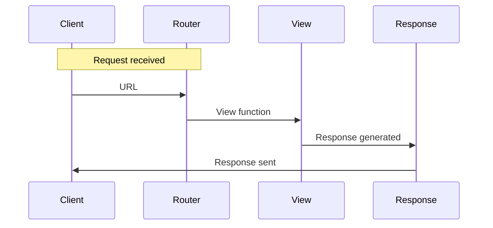

# Routing and Views
## Overview
Routing and views are fundamental components of the Flask web framework, enabling the mapping of URLs to specific application endpoints. This section delves into the details of URL routing, blueprint registration, and view function dispatch, providing a comprehensive understanding of how Flask handles requests and responses. The routing system in Flask is designed to be flexible and modular, allowing developers to define routes and views in a way that is easy to manage and maintain.

Flask's routing system is based on the concept of mapping URLs to specific view functions, which are responsible for handling requests and returning responses. This is achieved through the use of the `@app.route()` decorator, which maps a URL to a specific view function. The `@app.route()` decorator takes several parameters, including the URL rule, the view function, and any additional options.

## Key Components / Concepts
In Flask, routing is achieved through the use of the `@app.route()` decorator, which maps a URL to a specific view function. View functions are responsible for handling requests and returning responses. Blueprints, on the other hand, provide a way to organize related views and other application functions into a single unit, making it easier to manage complex applications.

A blueprint is essentially a self-contained component of an application that can define its own routes, templates, and static files. Blueprints can be registered with the application, making their routes and views available to the application. This allows developers to break down a large application into smaller, more manageable components.

### View Functions
View functions are the core of Flask's routing system. They are responsible for handling requests and returning responses. A view function can be any Python function that takes a request object as an argument and returns a response object. View functions can be defined using the `@app.route()` decorator, which maps a URL to a specific view function.

### Blueprints
Blueprints are a way to organize related views and other application functions into a single unit. A blueprint can define its own routes, templates, and static files, making it easier to manage complex applications. Blueprints can be registered with the application, making their routes and views available to the application.

## How it Works
When a request is made to a Flask application, the routing system kicks in to determine which view function should handle the request. This is done by matching the requested URL against the routes defined in the application. Once a match is found, the corresponding view function is called, and it returns a response to the client.

The routing process involves several steps:

1. **URL Parsing**: The URL is parsed to extract the path, query string, and other components.
2. **Route Matching**: The parsed URL is matched against the routes defined in the application.
3. **View Function Dispatch**: If a match is found, the corresponding view function is called.
4. **Response Generation**: The view function generates a response, which is then sent back to the client.

Blueprints play a crucial role in this process, as they allow developers to define routes and views in a modular fashion. A blueprint can be registered with the application, making its routes and views available to the application.

## Example(s)
Consider the following example from `tests/test_blueprints.py`:
```python
def about():
    return flask.url_for(".index")
```
In this example, the `about` function generates a URL for the index page of the application using the `url_for` function. This demonstrates how routes can be defined and used within a Flask application.

Another example from `tests/test_basic.py` shows how a view class can be defined to handle requests:
```python
class View:
    def __init__(self, app):
        app.add_url_rule("/", "index", self.index)
        app.add_url_rule("/<test>/", "index", self.index)

    def index(self, test="a"):
        return test
```
This example illustrates how a view class can be used to define multiple routes and handle requests accordingly.

## Diagram(s)
```mermaid
flowchart LR
    A[Request] -->|URL|> B{Routing}
    B -->|Match|> C[View Function]
    B -->|No Match|> D[404 Error]
    C -->|Response|> E[Client]
```
This flowchart shows the basic routing process in Flask, from the initial request to the response being sent back to the client.


This sequence diagram shows the interaction between the client, router, view, and response in the routing process.

## References
* `tests/test_blueprints.py`: This file contains examples of route definitions and view functions, including the `about` function and the `index` function.
* `tests/test_basic.py`: This file provides examples of view classes and route definitions, such as the `View` class.
* `src/flask/views.py`: This file is part of the Flask framework and contains the implementation of view functions and classes.
* `src/flask/blueprints.py`: This file is also part of the Flask framework and contains the implementation of blueprints.
* `docs/patterns/urlprocessors.rst`: This documentation file provides information on URL processing and routing in Flask.