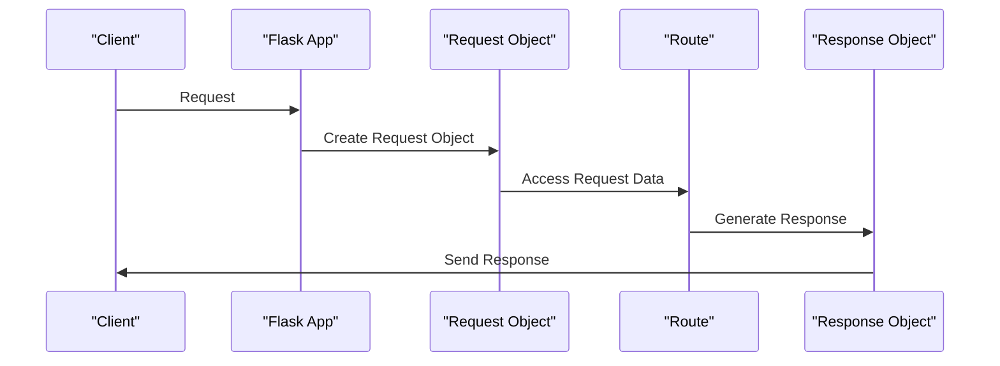

# Request and Response Wrappers
## Overview
The Request and Response objects in Flask are wrappers around the Werkzeug primitives, providing a more convenient and Pythonic interface for handling HTTP requests and responses. These objects are crucial components of the Flask framework, enabling developers to interact with the HTTP protocol in a straightforward and intuitive manner. The Request object represents an HTTP request and provides attributes and methods for accessing request data, such as headers, form data, and query parameters. The Response object represents an HTTP response and provides methods for setting response data, such as status codes, headers, and response bodies.

The use of Request and Response wrappers in Flask simplifies the process of handling HTTP requests and responses, allowing developers to focus on writing application logic rather than worrying about the underlying details of the HTTP protocol. By providing a high-level interface for interacting with HTTP requests and responses, Flask makes it easier for developers to build web applications quickly and efficiently.

## Key Components / Concepts
The key components involved in the implementation of Request and Response wrappers in Flask include:
- `flask.Request`: This object represents an HTTP request and provides attributes and methods for accessing request data, such as headers, form data, and query parameters. The `flask.Request` object is created by the Flask application when a request is made, and it is used by the application's routes to access request data and generate a response.
- `flask.Response`: This object represents an HTTP response and provides methods for setting response data, such as status codes, headers, and response bodies. The `flask.Response` object is typically created using the `flask.make_response` function, which takes the response data as an argument and returns a `flask.Response` object.
- `flask.make_response`: This function is used to create a Response object from various types of data, including strings, tuples, and dictionaries. The `flask.make_response` function is a convenient way to create a Response object, as it automatically sets the correct content type and encoding based on the type of data passed to it.

In addition to these key components, Flask also provides several other objects and functions that are used to implement the Request and Response wrappers. These include the `flask.g` object, which is used to store data that should be available for the duration of the request, and the `flask.session` object, which is used to store data that should be available across multiple requests.

## How it Works
When a request is made to a Flask application, the `flask.Request` object is created to represent the incoming request. This object is then used by the application's routes to access request data and generate a response. The response is typically created using the `flask.make_response` function, which takes the response data as an argument and returns a `flask.Response` object. This Response object is then returned by the route and sent back to the client.

The process of handling an HTTP request in Flask can be broken down into several steps:
1. The client makes a request to the Flask application.
2. The Flask application creates a `flask.Request` object to represent the incoming request.
3. The `flask.Request` object is used by the application's routes to access request data and generate a response.
4. The response is created using the `flask.make_response` function, which takes the response data as an argument and returns a `flask.Response` object.
5. The `flask.Response` object is returned by the route and sent back to the client.

## Example(s)
Here is an example of how to create a simple route in Flask that returns a Response object:
```python
from flask import Flask, make_response

app = Flask(__name__)

@app.route('/')
def index():
    return make_response('Hello, World!', 200)
```
In this example, the `make_response` function is used to create a Response object with the string 'Hello, World!' as the response body and a status code of 200.

Another example is to create a route that returns a JSON response:
```python
from flask import Flask, make_response, jsonify

app = Flask(__name__)

@app.route('/json')
def json():
    data = {'name': 'John', 'age': 30}
    return jsonify(data)
```
In this example, the `jsonify` function is used to create a Response object with the JSON data as the response body and a status code of 200.

## Diagram(s)
```mermaid
flowchart LR
    A[Client] -->|Request|> B[Flask App]
    B -->|Create Request Object|> C[Request Object]
    C -->|Access Request Data|> D[Route]
    D -->|Generate Response|> E[Response Object]
    E -->|Send Response|> A
```
This flowchart illustrates the process of handling an HTTP request in Flask, from the client making the request to the Flask application sending the response back to the client.


This sequence diagram illustrates the same process as the flowchart, but in a more detailed and step-by-step manner.

## References
- `tests/test_views.py`: This file contains examples of using the `flask.Request` and `flask.Response` objects to handle requests and generate responses.
- `tests/test_basic.py`: This file contains tests for the `flask.make_response` function and the `flask.Response` object.
- `src/flask/wrappers.py`: This file contains the implementation of the `flask.Request` and `flask.Response` objects.
- `src/flask/ctx.py`: This file contains the implementation of the request and application context objects, which are used to manage the request and response objects.
- `docs/core.rst`: This file contains documentation on the core components of Flask, including the Request and Response wrappers.