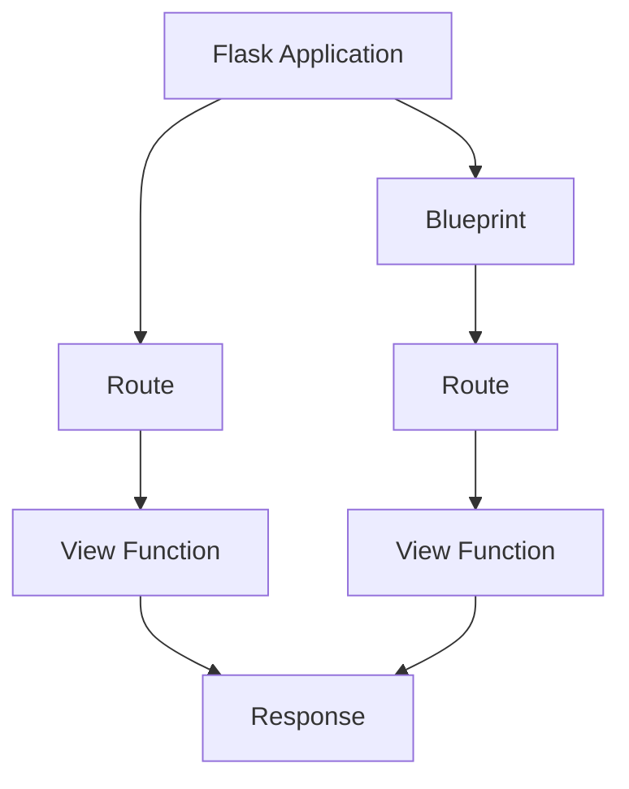

# Example Applications
The Flask repository includes several example applications to demonstrate its capabilities and provide a starting point for new projects.

## Overview
These example applications showcase the flexibility and simplicity of the Flask framework, from a basic "Hello, World!" application to more complex examples using blueprints.

## Key Components / Concepts
The key components of these example applications include:
- Flask application instances
- Routes and view functions
- Blueprints for organizing and structuring larger applications

## How it Works
Each example application is a self-contained Flask project, with its own application instance and configuration. The applications use routes and view functions to handle requests and return responses.

## Example(s)
One example is the "Hello, World!" application, which consists of a single route and view function:
```python
from flask import Flask

app = Flask(__name__)

@app.route("/")
def hello():
    return "Hello, World!"
```
Another example is the blueprint application, which demonstrates how to use blueprints to organize and structure a larger application:
```python
from flask import Flask, Blueprint

app = Flask(__name__)

admin = Blueprint("admin", __name__)
frontend = Blueprint("frontend", __name__)

app.register_blueprint(admin)
app.register_blueprint(frontend)
```

## Diagram(s)

This flowchart illustrates the basic structure of a Flask application, including routes, view functions, and blueprints.

## References
- [README.md](README.md)
- [tests/test_apps/blueprintapp/__init__.py](tests/test_apps/blueprintapp/__init__.py)
- [tests/test_blueprints.py](tests/test_blueprints.py)
- [tests/test_apps/cliapp/app.py](tests/test_apps/cliapp/app.py)
- [tests/test_apps/helloworld/hello.py](tests/test_apps/helloworld/hello.py)