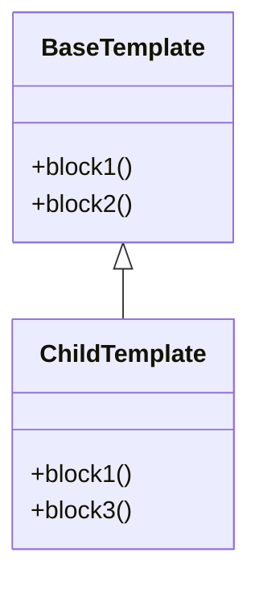

# Template Rendering
## Overview
Template rendering is a crucial aspect of web development, allowing developers to separate presentation logic from application logic. In the context of Flask, template rendering is achieved through the integration of the Jinja2 templating engine. This section will delve into the details of template rendering in Flask, including the key components, how it works, and examples of its usage. Template rendering enables developers to define templates with placeholders for dynamic content, making it easier to maintain and update web applications.

The Jinja2 templating engine provides a powerful and flexible way to render templates in Flask. It allows developers to define templates using a syntax that is similar to HTML, with additional features such as conditional statements, loops, and macros. The templating engine also provides a way to extend and override templates, making it easier to create complex and reusable templates.

## Key Components / Concepts
The key components involved in template rendering in Flask include:

* **Jinja2**: A templating engine that allows developers to define templates with placeholders for dynamic content. Jinja2 provides a wide range of features, including conditional statements, loops, and macros, making it a powerful and flexible templating engine.
* **Template Loader**: A component responsible for loading templates from a specified location. The template loader is responsible for finding and loading templates, and it provides a way to customize the template loading process.
* **Render Template**: A function that renders a template with the provided data. The render template function takes a template and a set of data as input, and it returns a rendered template that can be sent to the client.
* **Template Context**: The template context is the data that is passed to the template during rendering. The template context can include variables, functions, and other data that can be used in the template.
* **Template Inheritance**: Template inheritance is a feature of Jinja2 that allows developers to create a base template and extend it in child templates. This feature makes it easier to create complex and reusable templates.

## How it Works
The process of template rendering in Flask involves the following steps:

1. **Template Loading**: The template loader loads the template from the specified location. The template loader searches for the template in the specified location, and it returns the template if it is found.
2. **Data Preparation**: The data to be rendered in the template is prepared. The data can come from a variety of sources, including databases, files, and user input.
3. **Template Rendering**: The render template function renders the template with the prepared data. The render template function replaces the placeholders in the template with the actual data, and it returns a rendered template that can be sent to the client.
4. **Response Generation**: The rendered template is used to generate a response to the client. The response can include the rendered template, as well as other data such as headers and cookies.
5. **Response Sending**: The response is sent to the client. The response is sent over the network, and it is received by the client's web browser.

## Example(s)
The following example demonstrates how to render a template in Flask:
```python
from flask import Flask, render_template

app = Flask(__name__)

@app.route("/")
def index():
    return render_template("index.html", value=23)
```
In this example, the `index` function renders the `index.html` template with the `value` parameter set to 23. The `render_template` function is used to render the template, and it returns a rendered template that can be sent to the client.

Another example demonstrates how to use template inheritance in Flask:
```python
from flask import Flask, render_template

app = Flask(__name__)

@app.route("/")
def index():
    return render_template("base.html")

@app.route("/child")
def child():
    return render_template("child.html")
```
In this example, the `base.html` template is extended by the `child.html` template. The `child.html` template can override the blocks defined in the `base.html` template, making it easier to create complex and reusable templates.

## Diagram(s)
```mermaid
flowchart LR
    A[Request] -->|1. Receive Request|> B[Flask App]
    B -->|2. Prepare Data|> C[Data Preparation]
    C -->|3. Load Template|> D[Template Loader]
    D -->|4. Render Template|> E[Render Template]
    E -->|5. Generate Response|> F[Response Generation]
    F -->|6. Send Response|> G[Client]
```
This flowchart illustrates the process of template rendering in Flask, from receiving the request to sending the response.

Another diagram shows the template inheritance process:

This class diagram shows the relationship between the `BaseTemplate` and the `ChildTemplate`. The `ChildTemplate` extends the `BaseTemplate` and overrides the `block1` method.

## References
* `tests/test_templating.py`: This file contains examples of template rendering in Flask, including the use of custom template loaders and render template functions.
* `src/flask/templating.py`: This file contains the implementation of the templating engine in Flask, including the template loader and render template functions.
* `docs/templating.rst`: This file contains documentation on templating in Flask, including examples and best practices.
* `docs/patterns/templateinheritance.rst`: This file contains documentation on template inheritance in Flask, including examples and best practices.
* `examples/templates`: This directory contains examples of templates used in Flask, including templates that demonstrate template inheritance.