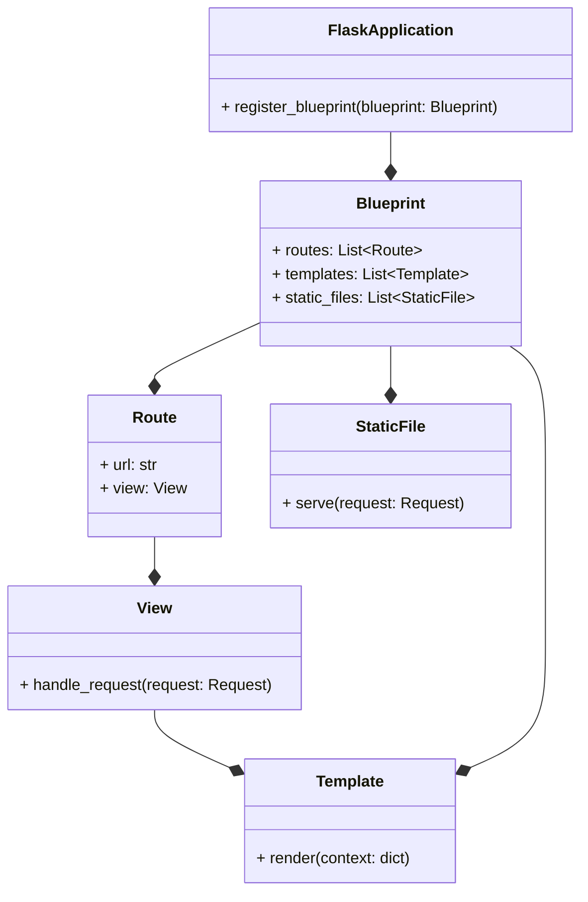
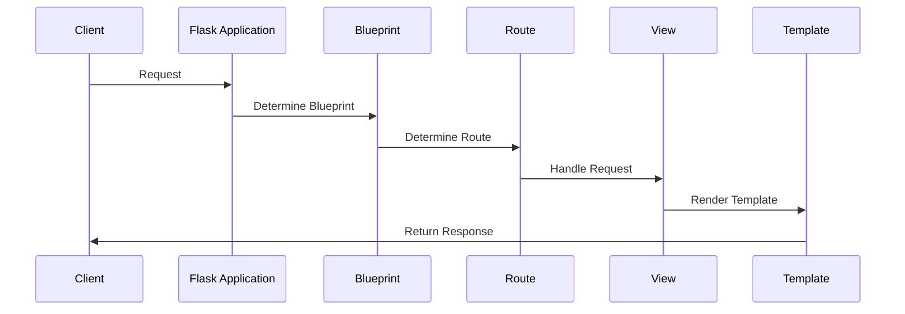

# Blueprint System
## Overview
The Blueprint system in Flask is a modular component architecture that allows for scalable application design. It enables developers to organize their application into smaller, reusable components, making it easier to manage and maintain complex applications. Blueprints are essentially a way to group related routes, templates, and static files together, providing a structured approach to building Flask applications. This modular design enables developers to break down their application into smaller, more manageable pieces, each with its own set of responsibilities.

The Blueprint system is a key feature of Flask, and it provides a number of benefits, including:

* **Modularity**: Blueprints allow developers to break down their application into smaller, independent components, making it easier to manage and maintain complex applications.
* **Reusability**: Blueprints can be reused across multiple applications, reducing code duplication and improving development efficiency.
* **Flexibility**: Blueprints can be easily registered and unregistered with the Flask application, making it simple to add or remove functionality as needed.

## Key Components / Concepts
The key components of the Blueprint system include:

* **Blueprints**: These are the core components of the system, representing a self-contained module of the application. Blueprints can be thought of as mini-applications, each with their own set of routes, templates, and static files.
* **Routes**: Routes are used to map URLs to specific functions or views within a Blueprint. They define the URL structure and handling for a particular part of the application.
* **Templates**: Templates are used to render dynamic content within a Blueprint. They provide a way to separate presentation logic from application logic, making it easier to maintain and update the application.
* **Static Files**: Static files, such as images, CSS, and JavaScript files, can be served directly by a Blueprint, providing a convenient way to manage application assets.
* **View Functions**: View functions are used to handle requests and return responses within a Blueprint. They are typically associated with a specific route and are responsible for rendering templates and returning data to the client.

## How it Works
The Blueprint system works by allowing developers to create and register Blueprints with the Flask application. Each Blueprint is responsible for its own set of routes, templates, and static files, which are then integrated into the main application. When a request is made to the application, Flask uses the Blueprint system to determine which Blueprint should handle the request, based on the URL and other factors.

Here is a high-level overview of the process:
```mermaid
flowchart LR
    A[Request] -->|URL|> B[Flask Application]
    B -->|Blueprint Registration|> C[Blueprint]
    C -->|Route Matching|> D[View Function]
    D -->|Template Rendering|> E[Response]
    E -->|Return to Client|> A
```
Caption: High-level overview of the Blueprint system in Flask.

The Blueprint system also provides a number of features for handling errors and exceptions, including:

* **Error Handling**: Blueprints can define custom error handlers to handle errors and exceptions that occur within the Blueprint.
* **Exception Handling**: Blueprints can define custom exception handlers to handle exceptions that occur within the Blueprint.

## Example(s)
To illustrate the use of Blueprints, consider a simple example where we have a Flask application with two Blueprints: `frontend` and `backend`. The `frontend` Blueprint handles user-facing routes, while the `backend` Blueprint handles API requests.
```python
from flask import Flask, Blueprint

app = Flask(__name__)

frontend = Blueprint('frontend', __name__, url_prefix='/frontend')
backend = Blueprint('backend', __name__, url_prefix='/backend')

@frontend.route('/')
def frontend_index():
    return 'Frontend Index'

@backend.route('/api/data')
def backend_data():
    return 'Backend Data'

app.register_blueprint(frontend)
app.register_blueprint(backend)
```
In this example, we define two Blueprints, `frontend` and `backend`, each with its own set of routes. We then register these Blueprints with the Flask application, using the `register_blueprint` method.

We can also use Blueprints to handle errors and exceptions, for example:
```python
@frontend.errorhandler(404)
def frontend_not_found(e):
    return 'Frontend Not Found', 404

@backend.errorhandler(500)
def backend_internal_server_error(e):
    return 'Backend Internal Server Error', 500
```
In this example, we define custom error handlers for the `frontend` and `backend` Blueprints, to handle 404 and 500 errors respectively.

## Diagram(s)
Here is a more detailed diagram showing the relationships between Blueprints, routes, and views:

Caption: Class diagram showing the relationships between Blueprints, routes, and views.

We can also use sequence diagrams to illustrate the flow of requests through the Blueprint system:

Caption: Sequence diagram showing the flow of requests through the Blueprint system.

## References
* `tests/test_blueprints.py`: This file contains examples of using Blueprints in Flask, including defining routes, templates, and static files.
* `tests/test_cli.py`: This file demonstrates how to use the Flask CLI to register Blueprints and run the application.
* `src/flask/blueprints.py`: This file contains the implementation of the Blueprint system in Flask, including the `Blueprint` class and related functions.
* `src/flask/sansio/blueprints.py`: This file contains additional functionality for working with Blueprints in Flask, including support for async/await and other features.
* `docs/blueprints.rst`: This file contains documentation on using Blueprints in Flask, including examples and tutorials.