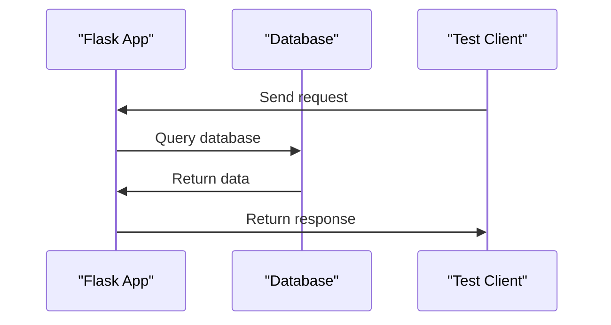

# Introduction to Flask Testing
## Overview
Flask testing is a crucial aspect of ensuring the reliability and stability of Flask applications. It involves writing and running tests to verify that the application behaves as expected under various conditions. In this section, we will introduce the concept of testing in Flask, including the different types of tests and how to run them. Testing is an essential part of the software development process, and Flask provides a robust testing framework to help developers ensure their applications are thoroughly tested.

Flask testing can be broadly categorized into two types: **unit testing** and **integration testing**. Unit testing focuses on individual components or units of code, such as functions or methods, to ensure they behave as expected. Integration testing, on the other hand, verifies how different components interact with each other, ensuring that the application works as a whole. Both types of testing are essential to ensure the overall quality and reliability of the application.

## Key Components / Concepts
There are several key components and concepts involved in Flask testing, including:
* **Unit tests**: These tests focus on individual components or units of code, such as functions or methods, to ensure they behave as expected. Unit tests are typically written using the `unittest` framework, which provides a rich set of tools for constructing and running tests.
* **Integration tests**: These tests verify how different components interact with each other, ensuring that the application works as a whole. Integration tests often involve testing the interactions between multiple components, such as databases, file systems, and network services.
* **Test client**: A test client is a simulated client that sends requests to the application, allowing us to test its behavior. The test client can be used to send HTTP requests to the application, simulating user interactions.
* **Fixtures**: Fixtures are setup functions that provide a fixed baseline for tests, ensuring that each test starts with a consistent state. Fixtures can be used to setup and teardown the application state before and after each test, ensuring that tests are isolated and do not interfere with each other.

## How it Works
To write tests in Flask, we typically use the `unittest` framework, which provides a rich set of tools for constructing and running tests. We can use the `app.test_client()` method to create a test client, which can be used to send requests to the application. We can also use fixtures to setup and teardown the application state before and after each test.

The testing process typically involves the following steps:
1. **Create a test client**: We create a test client using the `app.test_client()` method.
2. **Send a request**: We use the test client to send a request to the application.
3. **Verify the response**: We verify that the response from the application is as expected.
4. **Teardown**: We teardown the application state after each test, ensuring that tests are isolated and do not interfere with each other.

## Example(s)
For example, we can write a test to verify that a simple Flask view returns the correct response:
```python
def test_basic_view(app, client):
    @app.route("/")
    def index():
        return "Hello, World!"

    rv = client.get("/")
    assert rv.status_code == 200
    assert rv.data == b"Hello, World!"
```
This test creates a simple view that returns the string "Hello, World!", and then uses the test client to send a GET request to the view. The test then asserts that the response status code is 200 and that the response data is correct.

We can also write tests for more complex scenarios, such as testing the interactions between multiple components. For example:
```python
def test_user_login(app, client):
    # Create a user
    user = User(username="testuser", password="testpassword")
    db.session.add(user)
    db.session.commit()

    # Send a login request
    rv = client.post("/login", data={"username": "testuser", "password": "testpassword"})

    # Verify that the user is logged in
    assert rv.status_code == 200
    assert session["username"] == "testuser"
```
This test creates a user, sends a login request, and verifies that the user is logged in.

## Diagram(s)
```mermaid
flowchart
    participant App as "Flask App"
    participant TestClient as "Test Client"
    participant Test as "Test"

    Test->>App: Create test client
    App->>TestClient: Create test client instance
    Test->>TestClient: Send request
    TestClient->>App: Receive request
    App->>TestClient: Return response
    TestClient->>Test: Return response
    Test->>Test: Assert response
```
This diagram illustrates the flow of a test, from creating a test client to sending a request and asserting the response.

We can also use sequence diagrams to illustrate the interactions between multiple components. For example:

This diagram illustrates the interactions between the Flask app, database, and test client.

## References
* `tests/test_basic.py`: This file contains examples of basic tests, including tests for views and templates.
* `tests/test_testing.py`: This file contains examples of testing utilities, including the `echo` function and the `index` view.
* `tests/conftest.py`: This file contains fixtures and setup functions for tests.
* `README.md`: This file provides an overview of the Flask project and its testing framework.
* `app.py`: This file contains the Flask application code, including routes and views.