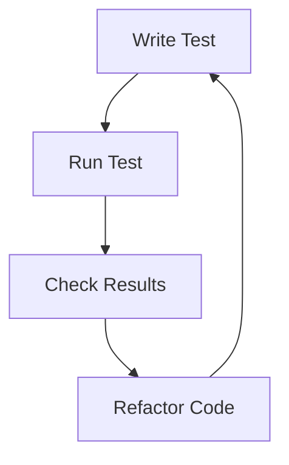

# Introduction to Flask Testing
## Overview
Flask testing is a crucial aspect of ensuring the reliability and stability of Flask applications. This page provides an introduction to testing in Flask, including the different types of tests and how to run them.

## Key Components / Concepts
The key components of Flask testing include:
* Unit tests: These tests focus on individual components or units of code, such as functions or methods.
* Integration tests: These tests verify how different components interact with each other.
* Functional tests: These tests simulate user interactions with the application.

## How it Works
Flask provides a built-in testing client that can be used to simulate requests to the application. The testing client can be used to test the application's routes, views, and templates.

## Example(s)
For example, the following code tests a simple route:
```python
import pytest
from flask import Flask

app = Flask(__name__)

@app.route("/")
def index():
    return "Hello World"

def test_index():
    with app.test_client() as client:
        response = client.get("/")
        assert response.status_code == 200
        assert response.data == b"Hello World"
```

## Diagram(s)

Caption: The testing cycle in Flask.

## References
* [tests/test_blueprints.py](tests/test_blueprints.py)
* [tests/test_basic.py](tests/test_basic.py)
* [tests/test_testing.py](tests/test_testing.py)
* [tests/conftest.py](tests/conftest.py)