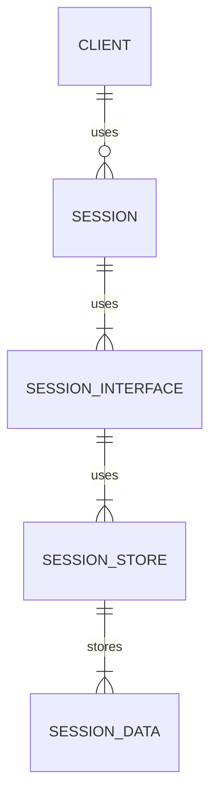

# Session Management
## Overview
Session management is a critical component of web applications, allowing them to store and retrieve data specific to each user's session. In Flask, session management is handled through the use of a session interface, which provides a way to store and retrieve session data. This page will provide an in-depth overview of the session management system used in Flask, including how to use sessions, how to customize the session interface, and the key components involved in the process.

Session management is essential for web applications as it enables them to maintain a persistent connection with the user, even after the user has closed their browser or navigated away from the site. This is achieved through the use of cookies, which are stored on the client's browser and contain a unique identifier that is used to retrieve the session data.

## Key Components / Concepts
The key components of the session management system in Flask include:

* **Session Interface**: The session interface is responsible for storing and retrieving session data. Flask provides a default session interface, but it can be customized to use a different interface. The session interface is typically implemented using a dictionary-like object that stores the session data.
* **Session Object**: The session object is a dictionary-like object that stores the session data. It is created by the session interface and is used to store and retrieve session data. The session object is typically implemented using a dictionary, where the keys are the session variables and the values are the corresponding values.
* **Session Key**: The session key is a unique key that is used to identify the session. It is stored in a cookie on the client's browser and is used to retrieve the session data. The session key is typically a random string that is generated by the server and stored in the cookie.
* **Session Store**: The session store is a repository that stores the session data. It can be implemented using a variety of storage mechanisms, such as files, databases, or memory. The session store is responsible for storing and retrieving the session data, and it is typically implemented using a key-value store.

## How it Works
Here is a detailed overview of how the session management system works in Flask:

1. **Request Received**: When a user makes a request to the application, the request is received by the server and processed by the Flask application.
2. **Session Interface**: The session interface is used to retrieve the session data from the session store. The session interface is responsible for storing and retrieving the session data, and it is typically implemented using a dictionary-like object.
3. **Session Key**: The session key is retrieved from the cookie stored on the client's browser. The session key is used to identify the session and retrieve the corresponding session data.
4. **Session Data Retrieval**: The session interface uses the session key to retrieve the session data from the session store. If the session data is not found in the session store, a new session object is created and stored in the session store.
5. **Session Object Creation**: The session object is created by the session interface and is used to store and retrieve session data. The session object is typically implemented using a dictionary, where the keys are the session variables and the values are the corresponding values.
6. **Session Data Storage**: The session data is stored in the session object, which is then stored in the session store. The session store is responsible for storing and retrieving the session data, and it is typically implemented using a key-value store.
7. **Response**: The response is sent back to the client, which includes the session cookie with the session key.

## Example(s)
Here is an example of how to use sessions in Flask:
```python
from flask import Flask, session

app = Flask(__name__)
app.secret_key = 'secret_key'

@app.route('/')
def index():
    session['testing'] = 42
    return 'Hello World'

@app.route('/get_session')
def get_session():
    return str(session)
```
In this example, the `index` function sets a session variable `testing` to the value `42`. The `get_session` function retrieves the session data and returns it as a string.

Another example of using sessions in Flask is to store user data, such as the user's name and email address. This can be achieved by storing the user data in the session object, like this:
```python
from flask import Flask, session

app = Flask(__name__)
app.secret_key = 'secret_key'

@app.route('/login')
def login():
    session['username'] = 'john_doe'
    session['email'] = 'john.doe@example.com'
    return 'Logged in successfully'

@app.route('/get_user_data')
def get_user_data():
    return str(session)
```
In this example, the `login` function sets the `username` and `email` session variables to the values `john_doe` and `john.doe@example.com`, respectively. The `get_user_data` function retrieves the session data and returns it as a string.

## Diagram(s)
```mermaid
flowchart
    participant Client as "Client"
    participant Server as "Server"
    participant SessionInterface as "Session Interface"
    participant SessionStore as "Session Store"

    Client->>Server: Request
    Server->>SessionInterface: Get Session
    SessionInterface->>SessionStore: Get Session Data
    SessionStore->>SessionInterface: Return Session Data
    SessionInterface->>Server: Return Session Object
    Server->>Client: Response
```
This diagram shows the flow of data between the client, server, session interface, and session store.

Another diagram that shows the session management process in more detail is:

This diagram shows the relationships between the client, session, session interface, session store, and session data.

## References
* `tests/test_basic.py`: This file contains examples of how to use sessions in Flask.
* `tests/test_reqctx.py`: This file contains examples of how to customize the session interface.
* `tests/test_session_interface.py`: This file contains examples of how to implement a custom session interface.
* `app.py`: This file contains an example of how to use sessions in a Flask application.