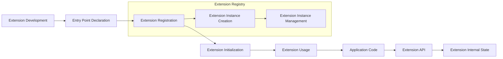

# Extension System
## Overview
The Flask extension system is a mechanism for building and integrating extensions to extend the core functionality of Flask. Extensions are reusable components that provide additional features and functionality to Flask applications. They can range from simple libraries that add new templating engines or database integrations to complex systems that provide authentication, authorization, or caching. The extension system is designed to be flexible and modular, allowing developers to easily create and integrate custom extensions into their Flask applications.

The Flask extension system is based on the concept of entry points, which are used to declare the availability of an extension and to provide metadata about the extension. Entry points are registered using a `setup.py` file or other packaging mechanism, and are used to initialize the extension and make it available to the Flask application.

## Key Components / Concepts
The key components of the Flask extension system include:

* **Extensions**: These are the reusable components that provide additional features and functionality to Flask applications. Extensions can be thought of as plugins that can be easily installed and uninstalled from a Flask application.
* **Entry Points**: These are the points at which extensions can be registered with Flask. Entry points are used to declare the availability of an extension and to provide metadata about the extension, such as its name, version, and dependencies.
* **Extension Registry**: This is a central registry that keeps track of all registered extensions. The extension registry is used to manage the lifecycle of extensions and to provide access to extension instances.
* **Extension Instances**: These are the actual instances of extensions that are created and managed by the Flask application. Extension instances are used to provide access to the extension's features and functionality.

## How it Works
The Flask extension system works as follows:

1. **Extension Development**: An extension developer creates a new extension by writing a Python package that contains the extension's code. The extension code should include an `__init__.py` file that defines the extension's entry point.
2. **Entry Point Declaration**: The extension developer declares the entry point for the extension using a `setup.py` file or other packaging mechanism. The entry point should include metadata about the extension, such as its name, version, and dependencies.
3. **Extension Registration**: When a Flask application is created, the extension registry is initialized and all registered extensions are loaded. The extension registry uses the entry points to discover and load the extensions.
4. **Extension Initialization**: Each extension is initialized by calling its `init_app` method, which sets up the extension's internal state and registers any necessary hooks or callbacks. The `init_app` method is called with the Flask application instance as an argument.
5. **Extension Usage**: The extension is then available for use within the Flask application, and its features and functionality can be accessed through the extension's API.

## Example(s)
Here is an example of how to create a simple Flask extension:
```python
# my_extension.py
from flask import Flask

class MyExtension:
    def __init__(self, app=None):
        self.app = app
        if app is not None:
            self.init_app(app)

    def init_app(self, app):
        # Initialize the extension's internal state
        app.config['MY_EXTENSION_CONFIG'] = 'default_value'

    def my_method(self):
        # Provide a method that can be used by the application
        return 'Hello, World!'

# Register the extension
def register_extension(app):
    app.extensions['my_extension'] = MyExtension(app)

# Use the extension in a Flask application
app = Flask(__name__)
register_extension(app)
print(app.extensions['my_extension'].my_method())  # Output: Hello, World!
```
This example shows how to create a simple Flask extension that provides a single method, `my_method`. The extension is registered with the Flask application using the `register_extension` function, and its features and functionality can be accessed through the extension's API.

## Diagram(s)

Caption: The Flask extension system workflow.

## References
* `tests/test_apps/blueprintapp/__init__.py`: An example of how to initialize a Flask web application and register blueprints.
* `tests/test_config.py`: An example of how to create a Flask application with customized configuration.
* `src/flask/extensions/__init__.py`: The implementation of the Flask extension system.
* `docs/extensions.rst`: Documentation on how to create and use Flask extensions.
* `src/flask/app.py`: The implementation of the Flask application class, which includes the extension registry and extension instance management.