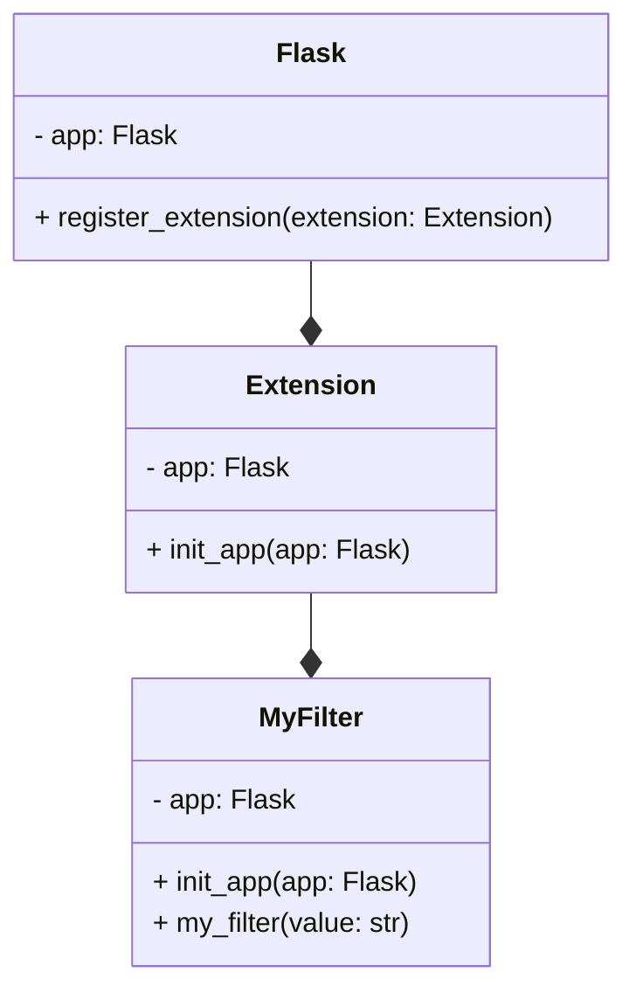

# Extension System
## Overview
The Flask extension system is a powerful feature that allows developers to extend the functionality of the Flask web framework. Extensions are reusable components that can be easily integrated into a Flask application, providing additional features and functionality. The extension system is designed to be flexible and modular, making it easy to create and use extensions.

## Key Components / Concepts
The Flask extension system consists of several key components and concepts, including:

* **Extensions**: These are reusable components that provide additional functionality to a Flask application. Extensions can be thought of as plugins that can be easily installed and used in a Flask application.
* **Extension classes**: These are classes that define the behavior of an extension. Extension classes typically inherit from the `flask.Extension` class and override its methods to provide custom behavior.
* **Application context**: This is the context in which an extension is used. The application context provides access to the Flask application instance and its configuration.
* **Configuration**: This refers to the process of setting up an extension to work with a Flask application. Configuration typically involves setting options and parameters that control the behavior of the extension.

## How it Works
The Flask extension system works by allowing developers to create and register extensions with a Flask application. When an extension is registered, it is given access to the application context and can use this context to provide its functionality. The extension can also use the application context to configure itself and to interact with other extensions.

Here is an example of how an extension might be registered with a Flask application:
```python
from flask import Flask
from myextension import MyExtension

app = Flask(__name__)
app.register_extension(MyExtension())
```
In this example, the `MyExtension` class is registered with the Flask application using the `register_extension` method. The `MyExtension` class is assumed to inherit from the `flask.Extension` class and to override its methods to provide custom behavior.

## Example(s)
Here is an example of a simple extension that provides a custom template filter:
```python
from flask import Extension

class MyFilter(Extension):
    def __init__(self, app=None):
        self.app = app

    def init_app(self, app):
        app.jinja_env.filters['my_filter'] = self.my_filter

    def my_filter(self, value):
        return value.upper()
```
This extension defines a custom template filter called `my_filter` that converts its input to uppercase. The extension is registered with a Flask application using the `register_extension` method, and the `my_filter` filter can then be used in templates to convert values to uppercase.

## Diagram(s)

This diagram shows the relationships between the `Flask` class, the `Extension` class, and the `MyFilter` class. The `Flask` class has a method called `register_extension` that is used to register an extension with the application. The `Extension` class has a method called `init_app` that is used to initialize the extension with the application. The `MyFilter` class is a subclass of the `Extension` class and provides a custom template filter.

## References
* [tests/test_config.py](tests/test_config.py)
* [tests/test_blueprints.py](tests/test_blueprints.py)
* [tests/test_templating.py](tests/test_templating.py)
* [docs/extensions.rst](docs/extensions.rst)
* [src/flask/json/__init__.py](src/flask/json/__init__.py)