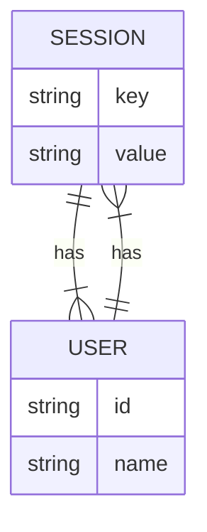

# Session Management
## Overview
Session management in Flask is a crucial aspect of handling user data across multiple requests. It allows storing and retrieving data specific to a user from one request to the next.

## Key Components / Concepts
- **Session Object**: The session object is an instance of a dictionary that stores data specific to a user from one request to the next. It is accessed through `flask.session`.
- **Session Interface**: Flask uses a session interface to handle the storage and retrieval of session data. The default interface stores session data in a secure cookie on the client-side.

## How it Works
1. When a user makes a request, Flask checks for a session cookie.
2. If a session cookie exists, Flask retrieves the session data from the cookie and makes it available through `flask.session`.
3. If no session cookie exists, Flask creates a new session.
4. Any changes made to `flask.session` during the request are saved back to the session cookie.

## Example(s)
```python
from flask import Flask, session

app = Flask(__name__)
app.secret_key = 'super secret key'

@app.route('/set')
def set_session():
    session['key'] = 'value'
    return 'Session set'

@app.route('/get')
def get_session():
    return session.get('key', 'Not set')
```

## Diagram(s)
### Session Management Flowchart
```mermaid
flowchart LR
    A[User Request] -->|1. Check for session cookie|> B{Session Cookie Exists?}
    B -->|Yes|> C[Retrieve session data from cookie]
    B -->|No|> D[Create new session]
    C --> E[Make session data available through flask.session]
    D --> E
    E --> F[Handle request]
    F --> G{Changes made to flask.session?}
    G -->|Yes|> H[Save changes back to session cookie]
    G -->|No|> I[End request]
    H --> I
```
### Session Entity Relationship Diagram


## References
- `flask/session.py`
- `tests/test_session_interface.py`
- `tests/test_reqctx.py`