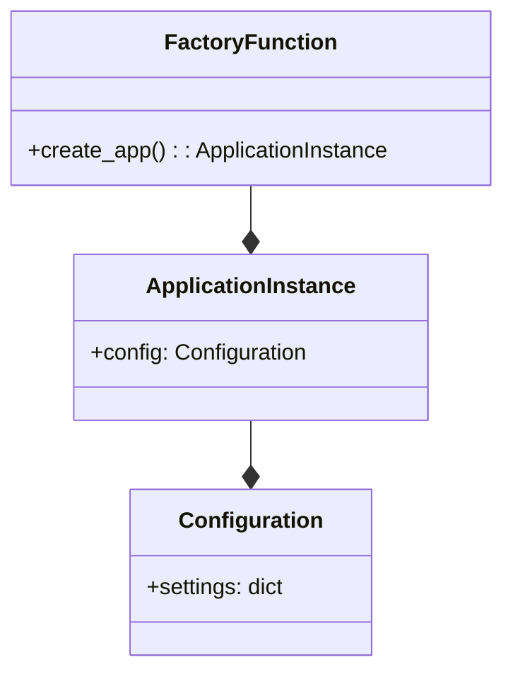

# Application Factory Pattern
## Overview
The Application Factory Pattern is a design approach used in Flask applications to create configurable and reusable instances of the application. This pattern is particularly useful for testing and deployment purposes, as it allows for the creation of multiple application instances with different configurations. In this section, we will delve into the details of the Application Factory Pattern, its key components, and how it works.

## Key Components / Concepts
The Application Factory Pattern revolves around the concept of a factory function that creates and configures a Flask application instance. The key components of this pattern include:

*   **Factory Function**: A function that creates and returns a Flask application instance. This function can take parameters to customize the application configuration.
*   **Application Instance**: The Flask application instance created by the factory function. This instance can be configured with different settings, such as database connections, secret keys, and logging configurations.
*   **Configuration**: The settings and parameters used to configure the application instance. These can include environment variables, configuration files, or hardcoded values.

## How it Works
The Application Factory Pattern works by defining a factory function that creates a new Flask application instance. This function can take parameters to customize the application configuration, such as the application name, database connections, or secret keys. The factory function returns the configured application instance, which can then be used to run the application.

Here is an example of a simple factory function:
```python
def create_app():
    app = Flask(__name__)
    app.config['SECRET_KEY'] = 'secret_key'
    return app
```
This factory function creates a new Flask application instance with a secret key set to `'secret_key'`. The `create_app` function can be called to create a new application instance, which can then be used to run the application.

## Example(s)
Let's consider an example where we want to create a Flask application with a customizable name. We can define a factory function that takes the application name as a parameter:
```python
def create_app(app_name):
    app = Flask(app_name)
    app.config['SECRET_KEY'] = 'secret_key'
    return app
```
We can then call this factory function to create a new application instance with a specific name:
```python
app = create_app('my_app')
```
This will create a new Flask application instance with the name `'my_app'` and a secret key set to `'secret_key'`.

## Diagram(s)
Here is a Mermaid diagram illustrating the Application Factory Pattern:

This diagram shows the relationships between the factory function, application instance, and configuration. The factory function creates a new application instance, which is configured with a set of settings.

## References
*   `tests/test_apps/cliapp/factory.py`: This file contains an example of a factory function that creates a Flask application instance with a customizable name.
*   `tests/conftest.py`: This file contains an example of a factory function that creates a Flask application instance with a testing configuration.
*   `tests/test_cli.py`: This file contains an example of a factory function that creates a Flask application instance with a customizable name and configuration.
*   `docs/patterns/appfactories.rst`: This file contains documentation on the Application Factory Pattern and its usage in Flask applications.
*   `src/flask/__init__.py`: This file contains the Flask application class and its related functions, which are used in the Application Factory Pattern.