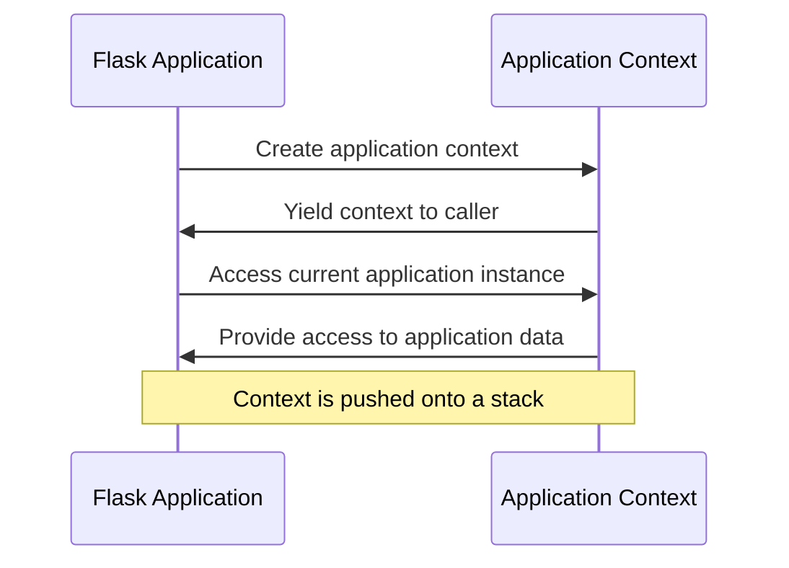
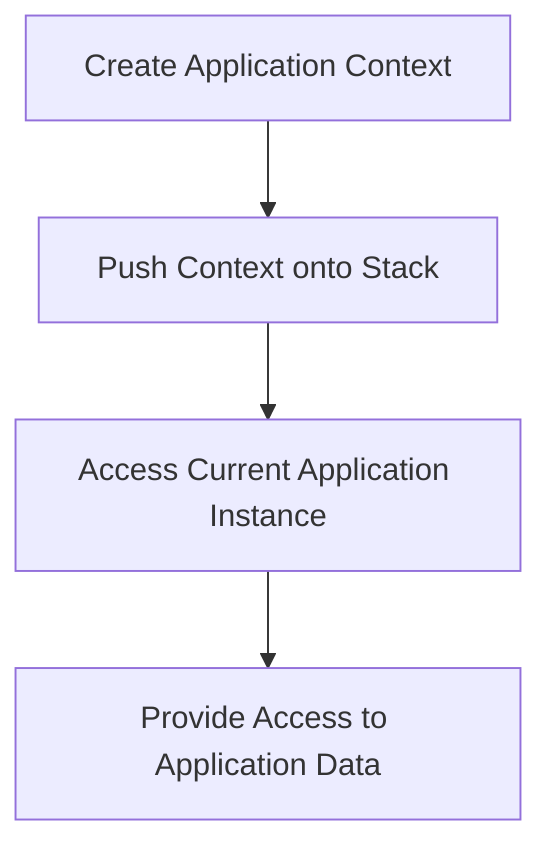

# Application Context
## Overview
The application context in Flask is used to handle requests and responses, providing access to the current application instance. This is crucial for URL generation and other application-specific tasks.

## Key Components / Concepts
The application context is created using the `app_context` function, which yields the context to the caller. Key components include the `app` object, which represents the current application instance, and the `g` object, which is used to store data that should be available for the duration of the request.

## How it Works
The application context is used to manage the application's state, providing access to the current application instance and other relevant data. It is created when the application is initialized and is used throughout the application's lifetime. The context is pushed onto a stack, allowing multiple contexts to be used simultaneously.

## Example(s)
Here is an example of how to use the application context:
```python
from flask import Flask

app = Flask(__name__)

with app.app_context():
    # Access the current application instance
    print(app.name)
```

## Diagram(s)

Application context sequence diagram.

Application context flowchart.

## References
* `src/flask/app.py`
* `src/flask/ctx.py`
* `tests/test_appctx.py`
* `tests/test_cli.py`