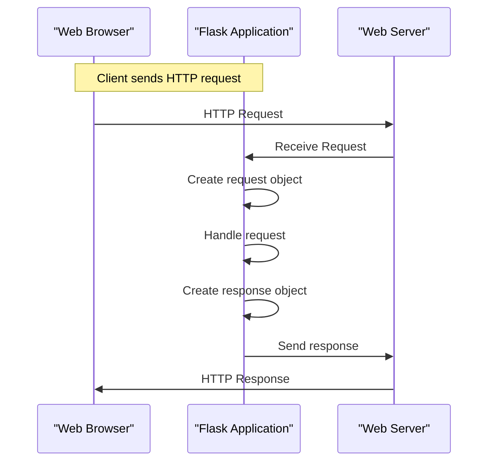

# Request and Response Objects
## Overview
Request and response objects are fundamental components in Flask, a micro web framework written in Python, located in the `flask` package. They represent the HTTP requests sent by clients and the responses sent back by the server, with the request object typically accessed through `flask.request` in files like `app.py`.

## Key Components / Concepts
The request object contains information about the incoming request, such as the method (GET, POST, etc.), the URL, headers, and any data sent with the request, as seen in `flask/request.py`. The response object, which can be created using `flask.Response` or `flask.make_response`, encapsulates the data and metadata to be sent back to the client, including the status code, headers, and response body, as defined in `flask/wrappers.py`.

## How it Works
When a client (like a web browser) sends an HTTP request to a Flask application, Flask creates a request object based on the incoming request, as handled in `flask/app.py`. The application can then access and manipulate this request object to handle the request appropriately. To send data back to the client, the application creates a response object, which Flask uses to construct the HTTP response, as illustrated in `tests/test_basic.py`.

## Example(s)
For example, a simple "Hello, World!" application might look like this:
```python
from flask import Flask, Response

app = Flask(__name__)

@app.route('/')
def hello_world():
    return Response("Hello, World!", status=200)
```
This example creates a response object with the string "Hello, World!" and a status code of 200 (OK), similar to examples found in `examples/minimal_app.py`.

## Diagram(s)

This sequence diagram illustrates the basic flow of an HTTP request and response in a Flask application, as described in `docs/architecture.rst`.

## References
- `flask/request.py`
- `flask/wrappers.py`
- `tests/test_basic.py`