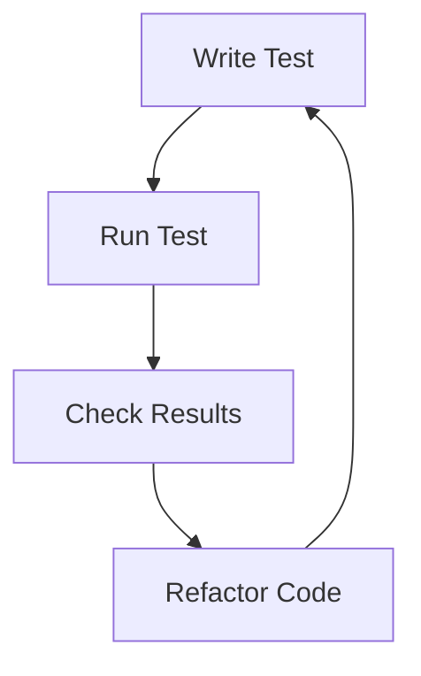

# Introduction to Flask Testing
## Overview
Flask testing is a crucial aspect of ensuring the reliability and stability of Flask applications, located in the `Flask Wiki` repository. This page provides an introduction to testing in Flask, including the different types of tests, such as unit tests, integration tests, and functional tests, and how to run them using the built-in testing client.

## Key Components / Concepts
The key components of Flask testing include:
* Unit tests: These tests focus on individual components or units of code, such as functions or methods, found in files like `tests/test_basic.py`.
* Integration tests: These tests verify how different components interact with each other, as seen in `tests/test_blueprints.py`.
* Functional tests: These tests simulate user interactions with the application, which can be implemented using `pytest` and the testing client.

## How it Works
Flask provides a built-in testing client, imported from `flask`, that can be used to simulate requests to the application. The testing client can be used to test the application's routes, views, and templates, as demonstrated in the example code.

## Example(s)
For example, the following code tests a simple route:
```python
import pytest
from flask import Flask

app = Flask(__name__)

@app.route("/")
def index():
    return "Hello World"

def test_index():
    with app.test_client() as client:
        response = client.get("/")
        assert response.status_code == 200
        assert response.data == b"Hello World"
```
This example illustrates how to use the testing client to test a route.

## Diagram(s)

Caption: The testing cycle in Flask, which involves writing tests, running tests, checking results, and refactoring code.

## References
* [tests/test_blueprints.py](tests/test_blueprints.py)
* [tests/test_basic.py](tests/test_basic.py)
* [tests/conftest.py](tests/conftest.py)