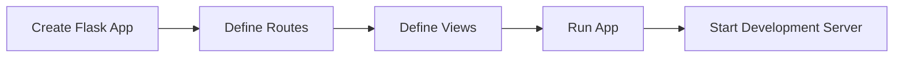

# Running Flask Applications
## Overview
Flask is a lightweight WSGI web application framework that enables developers to quickly create and scale web applications. It provides a flexible and modular structure, allowing developers to choose their own dependencies and project layout.

## Key Components / Concepts
The key components of a Flask application include the Flask application instance, routes, and views. The application instance is created using the `Flask` class, and routes are defined using the `@app.route` decorator.

## How it Works
To run a Flask application, you need to create an application instance and define routes and views. You can then use the `flask run` command to start the development server.

## Example(s)
Here is an example of a simple Flask application:
```python
from flask import Flask

app = Flask(__name__)

@app.route("/")
def hello():
    return "Hello, World!"
```
You can run this application using the `flask run` command.

## Diagram(s)

This diagram shows the basic steps involved in running a Flask application.

## References
* `tests/test_apps/cliapp/app.py`
* `tests/test_cli.py`
* `tests/test_apps/cliapp/inner1/__init__.py`