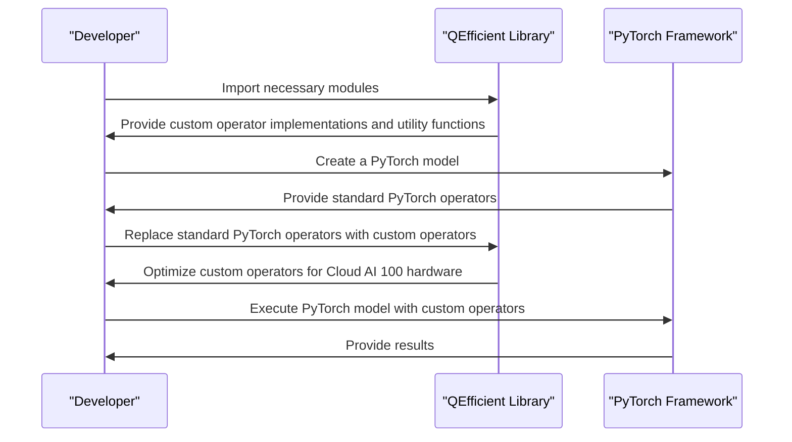

# Custom Operator Implementations
## Overview
Custom operator implementations are a crucial aspect of the QEfficient library, enabling efficient execution of transformer models on Cloud AI 100 hardware. These custom operators are designed to optimize specific components of the models, such as scatter/gather operations and RMSNorm, to achieve better performance and reduce computational overhead. The QEfficient library provides a range of custom operator implementations that can be used to accelerate the execution of transformer models on the Cloud AI 100 hardware.

The custom operator implementations in QEfficient are designed to work seamlessly with the PyTorch framework, allowing developers to easily integrate them into their existing workflows. By replacing the standard PyTorch operators with optimized, custom implementations, developers can achieve significant performance improvements and reduce the computational overhead associated with executing transformer models on the Cloud AI 100 hardware.

## Key Components / Concepts
The custom operator implementations in QEfficient include:
* `ctx_scatter_gather.py`: This module contains the implementation of the custom scatter/gather operator, which is used to efficiently handle tensor operations in the transformer models. The custom scatter/gather operator is designed to minimize memory access patterns and maximize data reuse, resulting in significant performance improvements.
* `ctx_scatter_gather_cb.py`: This module provides a callback function for the custom scatter/gather operator, allowing for flexible and efficient handling of tensor operations. The callback function enables developers to customize the behavior of the custom scatter/gather operator and optimize it for specific use cases.
* `rms_norm.py`: This module implements the custom RMSNorm operator, which is used to normalize the activations of the transformer models. The custom RMSNorm operator is designed to reduce the computational overhead associated with normalization and improve the overall performance of the transformer models.

In addition to these custom operator implementations, QEfficient also provides a range of utility functions and classes that can be used to support the development of custom operators. These utility functions and classes include tools for profiling and optimizing custom operators, as well as APIs for integrating custom operators with the PyTorch framework.

## How it Works
The custom operator implementations in QEfficient work by replacing the standard PyTorch operators with optimized, custom implementations that are tailored to the specific requirements of the Cloud AI 100 hardware. These custom operators are designed to minimize computational overhead and maximize performance, allowing for efficient execution of transformer models on the target hardware.

The process of replacing standard PyTorch operators with custom operators in QEfficient involves several steps:
1. Identifying the specific components of the transformer models that can be optimized using custom operators.
2. Implementing the custom operators using the QEfficient library's API and utility functions.
3. Integrating the custom operators with the PyTorch framework using the QEfficient library's APIs and tools.
4. Profiling and optimizing the custom operators to ensure maximum performance and efficiency.

By following these steps, developers can create custom operator implementations that are optimized for the Cloud AI 100 hardware and achieve significant performance improvements when executing transformer models.

## Example(s)
To use the custom operator implementations in QEfficient, you can follow these steps:
1. Import the necessary modules, such as `ctx_scatter_gather` and `rms_norm`.
2. Create an instance of the custom operator, such as `ctx_scatter_gather.CustomScatterGather`.
3. Use the custom operator to perform tensor operations, such as scattering and gathering.

For example, the following code snippet demonstrates how to use the custom scatter/gather operator to perform a scatter operation:
```python
import torch
from QEfficient.customop import ctx_scatter_gather

# Create a tensor
tensor = torch.randn(10, 10)

# Create an instance of the custom scatter/gather operator
scatter_gather = ctx_scatter_gather.CustomScatterGather()

# Perform a scatter operation using the custom operator
result = scatter_gather.scatter(tensor, indices)
```
This code snippet demonstrates how to use the custom scatter/gather operator to perform a scatter operation on a tensor. The custom operator is designed to minimize memory access patterns and maximize data reuse, resulting in significant performance improvements.

## Diagram(s)
```mermaid
flowchart LR
    A[PyTorch Model] -->|Replace Operators|> B[Custom Operators]
    B -->|Optimize Performance|> C[Cloud AI 100 Hardware]
    C -->|Execute Model|> D[Results]
```
This diagram illustrates the process of replacing standard PyTorch operators with custom operators in QEfficient, which are optimized for the Cloud AI 100 hardware.

In addition to this diagram, the following sequence diagram illustrates the process of creating and using a custom operator implementation in QEfficient:

This sequence diagram illustrates the process of creating and using a custom operator implementation in QEfficient, including importing necessary modules, creating a PyTorch model, replacing standard PyTorch operators with custom operators, and executing the PyTorch model with custom operators.

## References
* `QEfficient/customop/ctx_scatter_gather.py`
* `QEfficient/customop/ctx_scatter_gather_cb.py`
* `QEfficient/customop/rms_norm.py`
* `QEfficient/transformers/models/modeling_auto.py`
* `QEfficient/exporter/export_hf_to_cloud_ai_100.py`