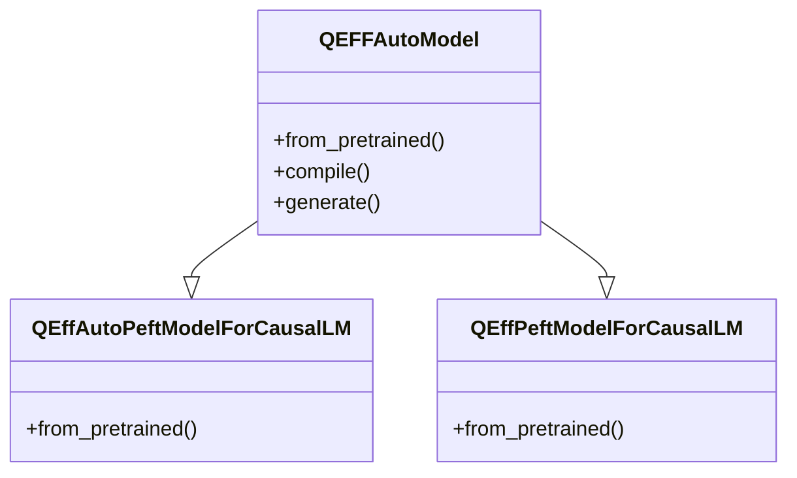

# Model Implementations
## Overview
QEfficient provides various model implementations for efficient transformer models. These models are designed to work with the Hugging Face transformers library and can be easily integrated into existing projects.

## Key Components / Concepts
The key components of QEfficient model implementations include:
* `QEFFAutoModel`: a class that manipulates any transformer model from the Hugging Face hub, allowing for easy initialization, compilation, and execution of the model.
* `QEffAutoPeftModelForCausalLM` and `QEffPeftModelForCausalLM`: models for causal language modeling.

## How it Works
The QEfficient models work by applying specific transforms to the model, including embedding-specific transforms and ONNX transforms. They also set the model's cache to True and update the attention implementation and low CPU memory usage settings.

## Example(s)
An example of using the `QEFFAutoModel` class is:
```python
from QEfficient import QEFFAutoModel
from transformers import AutoTokenizer

# Initialize the model using from_pretrained similar to transformers.AutoModel.
model = QEFFAutoModel.from_pretrained("model_name")

# Now you can directly compile the model for Cloud AI 100
model.compile(num_cores=16)  # Considering you have a Cloud AI 100 SKU

# Prepare input
tokenizer = AutoTokenizer.from_pretrained(model_name)
inputs = tokenizer("My name is", return_tensors="pt")

# You can now execute the model
model.generate(inputs)
```

## Diagram(s)

Caption: QEfficient Model Class Diagram

## References
* `tests/transformers/models/test_causal_lm_models.py`
* `QEfficient/transformers/models/modeling_auto.py`
* `tests/peft/test_peft_onnx_transforms.py`
* `QEfficient/transformers/models/llava_next/modeling_llava_next.py`