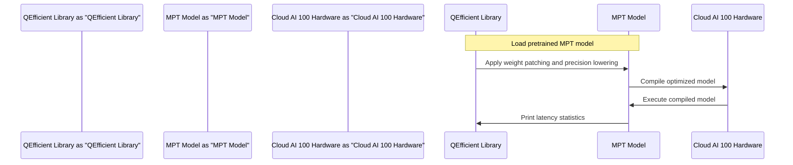

# QEfficientMPT Notebook
## Overview
The QEfficientMPT Notebook is a comprehensive demonstration of efficient inference for the MPT model family, including weight patching and precision lowering. This notebook showcases the capabilities of the QEfficient library in optimizing transformer models for deployment on Cloud AI 100 hardware. The QEfficientMPT Notebook is designed to provide a detailed example of how to optimize an MPT model for efficient inference, making it an essential resource for developers and researchers working with transformer models.

The QEfficient library is a critical component of the QEfficientMPT Notebook, as it provides the necessary tools and techniques for optimizing transformer models. The library is designed to work seamlessly with the MPT model family, which is optimized for semantic search and other natural language processing tasks. By leveraging the QEfficient library, developers can easily optimize their MPT models for efficient inference on Cloud AI 100 hardware, resulting in improved performance and reduced latency.

## Key Components / Concepts
The QEfficientMPT Notebook utilizes several key components and concepts, including:

* **QEfficient Library**: A library designed to optimize transformer models for efficient inference on Cloud AI 100 hardware. The QEfficient library provides a range of tools and techniques for optimizing transformer models, including weight patching and precision lowering.
* **MPT Model Family**: A family of transformer models optimized for semantic search and other natural language processing tasks. The MPT model family is designed to provide high-performance results while minimizing computational resources.
* **Weight Patching**: A technique used to optimize model weights for efficient inference. Weight patching involves modifying the model weights to reduce the computational complexity of the model, resulting in improved inference performance.
* **Precision Lowering**: A technique used to reduce the precision of model weights and activations, resulting in improved inference performance. Precision lowering involves reducing the numerical precision of the model weights and activations, which can result in significant improvements in inference performance.

In addition to these key components and concepts, the QEfficientMPT Notebook also utilizes several other important techniques and tools, including model compilation and execution. Model compilation involves converting the optimized model into a format that can be executed on Cloud AI 100 hardware, while model execution involves running the compiled model to demonstrate its performance and efficiency.

## How it Works
The QEfficientMPT Notebook works by:

1. Loading a pretrained MPT model using the QEfficient library. This involves loading the model weights and configurations from a file, such as `QEfficient/transformers/models/mpt/modeling_mpt.py`.
2. Applying weight patching and precision lowering techniques to optimize the model for efficient inference. This involves modifying the model weights and activations to reduce computational complexity and improve inference performance.
3. Compiling the optimized model for deployment on Cloud AI 100 hardware. This involves converting the optimized model into a format that can be executed on Cloud AI 100 hardware, such as a compiled model file.
4. Executing the compiled model to demonstrate its performance and efficiency. This involves running the compiled model on a sample dataset to demonstrate its inference performance and latency.

The QEfficientMPT Notebook also provides a range of tools and techniques for evaluating and optimizing the performance of the MPT model. This includes tools for measuring latency and throughput, as well as techniques for optimizing the model weights and activations for improved performance.

## Example(s)
The QEfficientMPT Notebook provides an example of how to optimize an MPT model for efficient inference on Cloud AI 100 hardware. The notebook demonstrates the application of weight patching and precision lowering techniques, as well as the compilation and execution of the optimized model. The example code is provided in the `notebooks/QEfficientMPT.ipynb` file, which can be used as a starting point for optimizing other MPT models.

In addition to the example code, the QEfficientMPT Notebook also provides a range of other examples and demonstrations, including:

* A demonstration of how to load and optimize a pretrained MPT model using the QEfficient library.
* A demonstration of how to apply weight patching and precision lowering techniques to optimize the model for efficient inference.
* A demonstration of how to compile and execute the optimized model on Cloud AI 100 hardware.

## Diagram(s)

Caption: QEfficientMPT Notebook Workflow

Caption: QEfficientMPT Notebook Sequence Diagram

## References
* `notebooks/QEfficientMPT.ipynb`: The QEfficientMPT Notebook file, which demonstrates the optimization of an MPT model for efficient inference on Cloud AI 100 hardware.
* `QEfficient/transformers/models/mpt/modeling_mpt.py`: The QEFfMptModel class, which is a modified version of the MptModel designed for semantic search.
* `QEfficient/transformers/models/modeling_auto.py`: The QEFFAutoModel class, which provides a unified interface for loading, exporting, compiling, and running various encoder-only transformer models on Cloud AI 100 hardware.
* `README.md`: The README file, which provides an overview of the QEfficient library and its capabilities.
* `docs/QEfficientMPT_Notebook.md`: The QEfficientMPT Notebook documentation file, which provides a detailed overview of the QEfficientMPT Notebook and its usage.