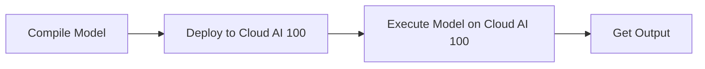

# Cloud Deployment
## Overview
Cloud deployment is a crucial aspect of Efficient Transformers, allowing users to leverage the power of cloud computing for their transformer-based models. This section provides an overview of the cloud deployment process using QEfficient.

## Key Components / Concepts
The key components involved in cloud deployment are:
* QEfficient: A library for efficient transformer models
* Cloud AI 100: A cloud-based platform for AI computing
* ONNX: An open format for representing trained machine learning models

## How it Works
The cloud deployment process involves the following steps:
1. Compile the model using QEfficient's compilation tools
2. Deploy the compiled model to Cloud AI 100
3. Use the `cloud_ai_100_exec_kv` function to execute the model on Cloud AI 100

## Example(s)
An example of deploying a model to Cloud AI 100 can be found in the `QEfficient/cloud/execute.py` file.

## Diagram(s)

Caption: Cloud Deployment Process

## References
* `QEfficient/cloud/execute.py`
* `QEfficient/utils/run_utils.py`
* `QEfficient/generation/text_generation_inference.py`