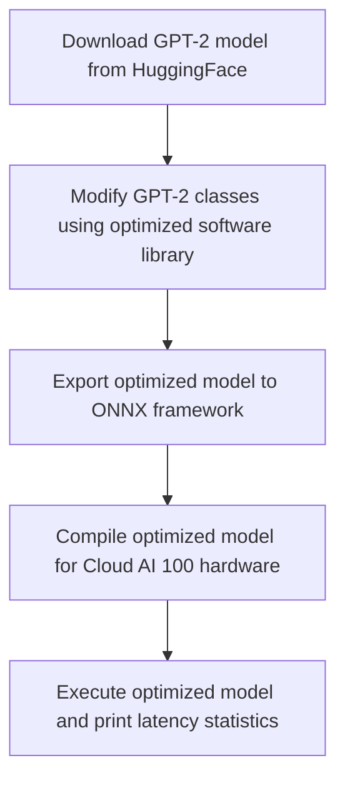

# QEfficientGPT2 Notebook
## Overview
The QEfficientGPT2 Notebook is a demonstration of the optimization and inference of the GPT-2 model using the Efficient Transformers workflow. This notebook showcases the onboarding of the GPT-2 model on the Cloud AI 100 platform, optimizing it for better performance. The model is downloaded from HuggingFace and modified using an optimized software library to generate a model for Cloud AI 100, with optimizations such as RMS Norm Fixes and KV Cache retention changes.

## Key Components / Concepts
The key components of the QEfficientGPT2 Notebook include:
* The `QEfficientGPT2.ipynb` file, which demonstrates the onboarding of the GPT-2 model on the Cloud AI 100 platform.
* The `QEFFAutoModelForCausalLM` class, which provides a unified interface for loading, exporting, compiling, and generating text with causal language models on Cloud AI 100 hardware.
* The `from_pretrained` function, which loads a QEfficient transformer model from a pretrained HuggingFace model or local path.

## How it Works
The QEfficientGPT2 Notebook works by:
1. Downloading the GPT-2 model from HuggingFace and saving it in a local cache directory.
2. Modifying the GPT-2 classes using the optimized software library to generate a model for Cloud AI 100.
3. Exporting the optimized model to the ONNX framework and compiling it for execution on the Cloud AI 100 hardware.
4. Executing the optimized model and printing latency statistics.

## Example(s)
An example of using the QEfficientGPT2 Notebook is:
```python
from QEfficient import QEFFAutoModelForCausalLM
model = QEFFAutoModelForCausalLM.from_pretrained("gpt2")
model.compile(num_cores=16)
tokenizer = AutoTokenizer.from_pretrained("gpt2")
model.generate(prompts=["Hi there!!"], tokenizer=tokenizer)
```
This example loads the GPT-2 model, compiles it for execution on 16 cores, and generates text based on the prompt "Hi there!!".

## Diagram(s)

This flowchart illustrates the steps involved in optimizing and inferring the GPT-2 model using the Efficient Transformers workflow.

## References
* `notebooks/QEfficientGPT2.ipynb`: The QEfficientGPT2 Notebook file, which demonstrates the onboarding of the GPT-2 model on the Cloud AI 100 platform.
* `QEfficient/transformers/models/modeling_auto.py`: The file containing the `QEFFAutoModelForCausalLM` class, which provides a unified interface for loading, exporting, compiling, and generating text with causal language models on Cloud AI 100 hardware.
* `docs/source/quick_start.md`: The Quick Start guide for the QEfficient Library, which provides an overview of the library and its usage.
* `pyproject.toml`: The project file for the QEfficient Library, which specifies the dependencies and configuration for the library.
* `docs/source/introduction.md`: The introduction to the Qualcomm "efficient-transformers" library, which provides an overview of the library and its purpose.