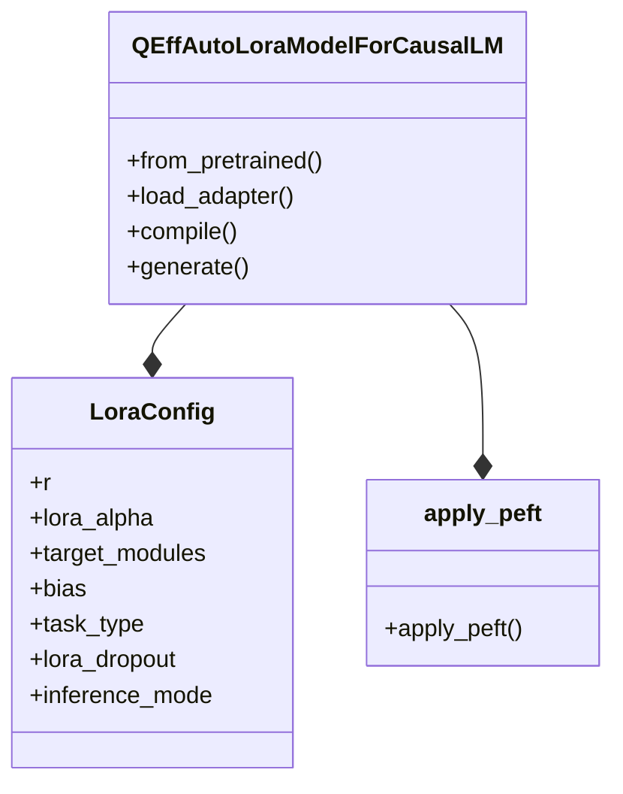

# PEFT LoRA Integration
## Overview
The PEFT (Parameter-Efficient Fine-Tuning) LoRA (Low-Rank Adaptation) integration is a key component of the QEfficient library, enabling efficient fine-tuning of large pre-trained models. This integration allows for the application of LoRA adapters to specific modules within a model, facilitating mixed batch inference on Cloud AI 100 hardware.

## Key Components / Concepts
The PEFT LoRA integration consists of several key components and concepts:
* **LoRA Adapters**: These are small, learnable modules that are applied to specific parts of a pre-trained model to adapt it to a new task or dataset.
* **QEffAutoLoraModelForCausalLM**: This is a class that enables the loading and running of causal language models with LoRA adapters on Cloud AI 100 hardware.
* **LoraConfig**: This is a configuration class that defines the parameters for LoRA, including the rank, target modules, and dropout rate.
* **apply_peft**: This is a function that applies PEFT to a given model if enabled in the training configuration.

## How it Works
The PEFT LoRA integration works as follows:
1. A pre-trained model is loaded and configured with a LoRA adapter using the `QEffAutoLoraModelForCausalLM` class.
2. The `apply_peft` function is called to apply PEFT to the model, which configures and applies the LoRA adapter to the specified modules.
3. The model is then compiled and exported for use on Cloud AI 100 hardware.
4. During inference, the `generate` function is called to generate output for a batch of prompts using the compiled model and LoRA adapter.

## Example(s)
Here is an example of how to use the PEFT LoRA integration:
```python
from QEfficient.peft.lora import QEffAutoLoraModelForCausalLM
from transformers import AutoTokenizer

# Load pre-trained model and tokenizer
model = QEffAutoLoraModelForCausalLM.from_pretrained("mistralai/Mistral-7B-v0.1")
tokenizer = AutoTokenizer.from_pretrained("mistralai/Mistral-7B-v0.1")

# Load LoRA adapter
model.load_adapter("predibase/gsm8k", "gsm8k")

# Compile and export model
model.compile()

# Generate output for a batch of prompts
prompts = ["code prompt", "math prompt", "generic"]
outputs = model.generate(prompts=prompts, tokenizer=tokenizer, prompt_to_adapter_mapping=["gsm8k", "base", "base"])
```

## Diagram(s)

This class diagram shows the relationships between the `QEffAutoLoraModelForCausalLM` class, the `LoraConfig` class, and the `apply_peft` function.

## References
* `QEfficient/peft/lora/auto.py`
* `QEfficient/peft/lora/pytorch_transforms.py`
* `QEfficient/finetune/configs/peft_config.py`
* `QEfficient/cloud/finetune.py`