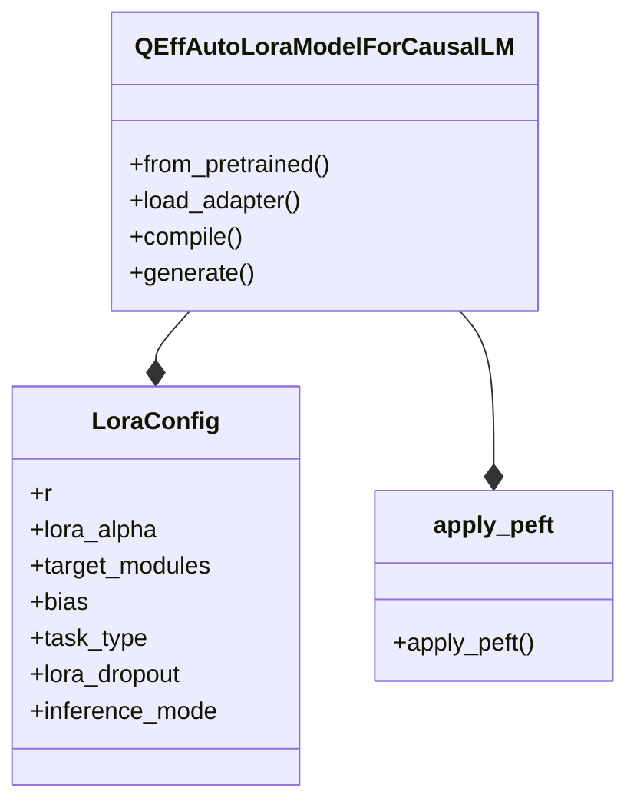
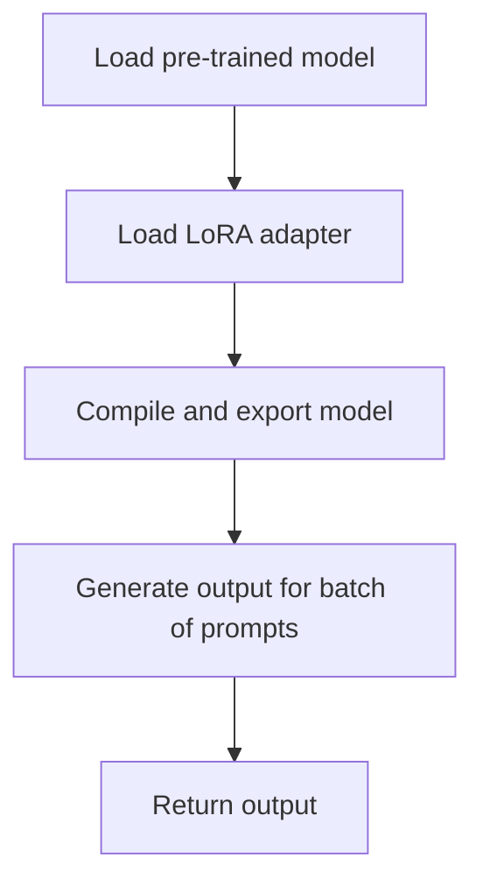

# PEFT LoRA Integration
## Overview
The PEFT (Parameter-Efficient Fine-Tuning) LoRA (Low-Rank Adaptation) integration is a key component of the QEfficient library, enabling efficient fine-tuning of large pre-trained models. This integration allows for the application of LoRA adapters to specific modules within a model, facilitating mixed batch inference on Cloud AI 100 hardware. The PEFT LoRA integration is designed to work seamlessly with the QEfficient library, providing a flexible and efficient way to adapt pre-trained models to new tasks or datasets.

The integration of PEFT and LoRA enables the use of low-rank adaptation techniques to fine-tune pre-trained models, reducing the computational requirements and memory usage associated with traditional fine-tuning methods. This makes it possible to fine-tune large pre-trained models on smaller datasets, reducing the risk of overfitting and improving the overall performance of the model.

## Key Components / Concepts
The PEFT LoRA integration consists of several key components and concepts:
* **LoRA Adapters**: These are small, learnable modules that are applied to specific parts of a pre-trained model to adapt it to a new task or dataset. LoRA adapters are designed to be compact and efficient, making them ideal for use in resource-constrained environments.
* **QEffAutoLoraModelForCausalLM**: This is a class that enables the loading and running of causal language models with LoRA adapters on Cloud AI 100 hardware. The `QEffAutoLoraModelForCausalLM` class provides a simple and intuitive interface for working with LoRA adapters, making it easy to integrate them into existing workflows.
* **LoraConfig**: This is a configuration class that defines the parameters for LoRA, including the rank, target modules, and dropout rate. The `LoraConfig` class provides a flexible way to customize the behavior of LoRA adapters, allowing users to tailor them to their specific use case.
* **apply_peft**: This is a function that applies PEFT to a given model if enabled in the training configuration. The `apply_peft` function is responsible for configuring and applying the LoRA adapter to the specified modules, making it a critical component of the PEFT LoRA integration.

## How it Works
The PEFT LoRA integration works as follows:
1. A pre-trained model is loaded and configured with a LoRA adapter using the `QEffAutoLoraModelForCausalLM` class. This involves specifying the pre-trained model, the LoRA adapter, and any additional configuration options.
2. The `apply_peft` function is called to apply PEFT to the model, which configures and applies the LoRA adapter to the specified modules. This step is critical, as it enables the use of low-rank adaptation techniques to fine-tune the pre-trained model.
3. The model is then compiled and exported for use on Cloud AI 100 hardware. This involves optimizing the model for the target hardware, ensuring that it can be executed efficiently and effectively.
4. During inference, the `generate` function is called to generate output for a batch of prompts using the compiled model and LoRA adapter. This step is where the PEFT LoRA integration really shines, as it enables the use of mixed batch inference to generate high-quality output for a wide range of prompts.

The PEFT LoRA integration also supports a range of additional features, including:
* **Mixed batch inference**: This allows the model to generate output for multiple prompts in a single batch, improving efficiency and reducing latency.
* **Low-rank adaptation**: This enables the use of low-rank adaptation techniques to fine-tune the pre-trained model, reducing the computational requirements and memory usage associated with traditional fine-tuning methods.
* **Cloud AI 100 hardware support**: This allows the model to be executed on Cloud AI 100 hardware, providing a high-performance and scalable platform for inference.

## Example(s)
Here is an example of how to use the PEFT LoRA integration:
```python
from QEfficient.peft.lora import QEffAutoLoraModelForCausalLM
from transformers import AutoTokenizer

# Load pre-trained model and tokenizer
model = QEffAutoLoraModelForCausalLM.from_pretrained("mistralai/Mistral-7B-v0.1")
tokenizer = AutoTokenizer.from_pretrained("mistralai/Mistral-7B-v0.1")

# Load LoRA adapter
model.load_adapter("predibase/gsm8k", "gsm8k")

# Compile and export model
model.compile()

# Generate output for a batch of prompts
prompts = ["code prompt", "math prompt", "generic"]
outputs = model.generate(prompts=prompts, tokenizer=tokenizer, prompt_to_adapter_mapping=["gsm8k", "base", "base"])
```
This example demonstrates how to load a pre-trained model and LoRA adapter, compile and export the model, and generate output for a batch of prompts using the `generate` function.

## Diagram(s)

This class diagram shows the relationships between the `QEffAutoLoraModelForCausalLM` class, the `LoraConfig` class, and the `apply_peft` function. The diagram illustrates how the `QEffAutoLoraModelForCausalLM` class uses the `LoraConfig` class to configure the LoRA adapter, and how the `apply_peft` function is used to apply PEFT to the model.


This flowchart shows the high-level workflow of the PEFT LoRA integration. The flowchart illustrates how the pre-trained model and LoRA adapter are loaded, how the model is compiled and exported, and how output is generated for a batch of prompts.

## References
* `QEfficient/peft/lora/auto.py`
* `QEfficient/peft/lora/pytorch_transforms.py`
* `QEfficient/finetune/configs/peft_config.py`
* `QEfficient/cloud/finetune.py`
* `QEfficient/peft/lora/lora_config.py`