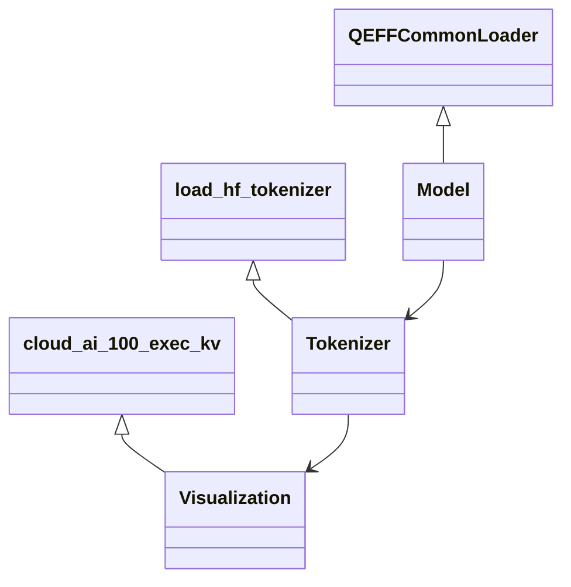

# Notebook Helper Functions
## Overview
The `notebooks` package in the `quic/efficient-transformers` repository provides a comprehensive set of utility functions designed to simplify the process of loading models, tokenizing input, and visualizing results. These helper functions are built to make it easier to work with the QEfficient library and to facilitate the development of custom notebooks. By leveraging these functions, users can streamline their workflow, reduce the complexity of their code, and focus on the core aspects of their projects.

The `notebooks` package is organized into several modules, each containing a specific set of functions and classes. The `QEFFCommonLoader` class, for example, provides a unified interface for loading Hugging Face models, making it easy to switch between different models and configurations. The `load_hf_tokenizer` function, on the other hand, loads a pre-trained tokenizer from the Hugging Face model hub, allowing for easy tokenization of input text.

## Key Components / Concepts
The notebook helper functions are built around several key components, including:

* **Model loading**: The `QEFFCommonLoader` class provides a unified interface for loading Hugging Face models, making it easy to switch between different models and configurations. This class supports a wide range of models, including but not limited to, `gpt2`, `bert`, and `roberta`.
* **Tokenization**: The `load_hf_tokenizer` function loads a pre-trained tokenizer from the Hugging Face model hub, allowing for easy tokenization of input text. This function supports various tokenization strategies, including word-level, subword-level, and character-level tokenization.
* **Result visualization**: The `cloud_ai_100_exec_kv` function generates output by executing a compiled model on Cloud AI 100 hardware, providing a convenient way to visualize the results of model inference. This function supports various visualization options, including text, image, and graph visualization.

In addition to these key components, the notebook helper functions also provide a range of utility functions for tasks such as data preprocessing, model evaluation, and hyperparameter tuning. These functions are designed to be easy to use and to require minimal configuration, making it easy to get started with the QEfficient library.

## How it Works
The notebook helper functions work by providing a set of pre-built functions that can be used to perform common tasks, such as loading models, tokenizing input, and visualizing results. These functions are designed to be easy to use and to require minimal configuration, making it easy to get started with the QEfficient library.

For example, the `load_hf_tokenizer` function can be used to load a pre-trained tokenizer from the Hugging Face model hub, like this:
```python
tokenizer = load_hf_tokenizer("gpt2")
```
Similarly, the `cloud_ai_100_exec_kv` function can be used to generate output by executing a compiled model on Cloud AI 100 hardware, like this:
```python
output = cloud_ai_100_exec_kv(tokenizer, "path/to/compiled/model")
```
The `QEFFCommonLoader` class can be used to load a Hugging Face model, like this:
```python
model = QEFFCommonLoader.from_pretrained("gpt2")
```
These functions can be combined to create a workflow that loads a model, tokenizes some input text, and visualizes the results.

## Example(s)
Here is an example of how the notebook helper functions can be used to load a model, tokenize some input text, and visualize the results:
```python
# Load the model and tokenizer
model = QEFFCommonLoader.from_pretrained("gpt2")
tokenizer = load_hf_tokenizer("gpt2")

# Tokenize some input text
input_text = "Hello, world!"
inputs = tokenizer(input_text, return_tensors="pt")

# Generate output using the model
output = model.generate(inputs)

# Visualize the results
output = cloud_ai_100_exec_kv(tokenizer, "path/to/compiled/model")
```
This example demonstrates how to use the notebook helper functions to load a model, tokenize some input text, and visualize the results. The `QEFFCommonLoader` class is used to load the model, the `load_hf_tokenizer` function is used to load the tokenizer, and the `cloud_ai_100_exec_kv` function is used to visualize the results.

Another example is to use the notebook helper functions to fine-tune a pre-trained model on a custom dataset. This can be done by using the `QEFFCommonLoader` class to load the pre-trained model, and then using the `load_hf_tokenizer` function to load the tokenizer. The `cloud_ai_100_exec_kv` function can then be used to visualize the results of the fine-tuning process.

## Diagram(s)
```mermaid
flowchart LR
    A[Load Model] -->|model|> B[Tokenize Input]
    B -->|inputs|> C[Generate Output]
    C -->|output|> D[Visualize Results]
    D -->|visualization|> E[Save Results]
```
This flowchart shows the basic workflow of the notebook helper functions, from loading the model to saving the results. The `QEFFCommonLoader` class is used to load the model, the `load_hf_tokenizer` function is used to load the tokenizer, and the `cloud_ai_100_exec_kv` function is used to visualize the results.

Another diagram that shows the relationship between the different components of the notebook helper functions is:

This class diagram shows the relationship between the different components of the notebook helper functions. The `QEFFCommonLoader` class is used to load the model, the `load_hf_tokenizer` function is used to load the tokenizer, and the `cloud_ai_100_exec_kv` function is used to visualize the results.

## References
* `QEfficient/transformers/models/modeling_auto.py`
* `QEfficient/utils/_utils.py`
* `notebooks/__init__.py`
* `notebooks/QEfficientGPT2.ipynb`
* `quic/efficient-transformers/notebooks/helpers.py`