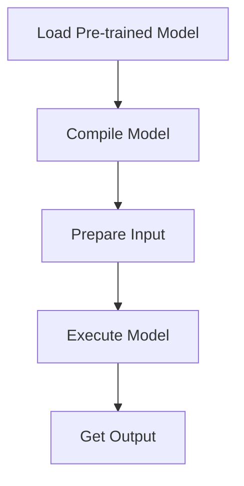

# Model-Specific Examples
## Overview
This section provides examples of using specific models with QEfficient. QEfficient is a library that allows for efficient deployment of transformer-based models.

## Key Components / Concepts
The key components of QEfficient include the `QEFFAutoModel` class, which is used to manipulate transformer models from the Hugging Face hub, and the `QEffPeftModelForCausalLM` class, which is used for causal language models.

## How it Works
To use QEfficient, you first need to import the necessary classes and models. You can then use the `from_pretrained` method to load a pre-trained model and compile it for use with QEfficient.

## Example(s)
Here is an example of how to use the `QEFFAutoModel` class:
```python
from QEfficient import QEFFAutoModel
from transformers import AutoTokenizer

# Initialize the model using from_pretrained
model = QEFFAutoModel.from_pretrained("model_name")

# Compile the model for Cloud AI 100
model.compile(num_cores=16)

# Prepare input
tokenizer = AutoTokenizer.from_pretrained(model_name)
inputs = tokenizer("My name is", return_tensors="pt")

# Execute the model
model.generate(inputs)
```

## Diagram(s)

Caption: Flowchart of the QEfficient workflow.

## References
* `QEfficient/peft/__init__.py`
* `QEfficient/transformers/models/modeling_auto.py`
* `QEfficient/transformers/modeling_utils.py`
* `examples/draft_spd_inference.py`