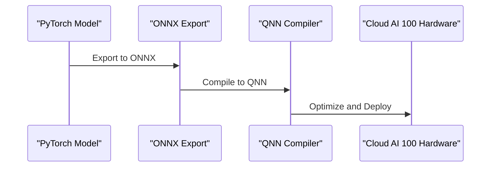

# Compilation Pipeline
## Overview
The compilation pipeline is a critical component of the QEfficient framework, responsible for converting PyTorch models into QNN-compatible binaries for deployment on Cloud AI 100 hardware. This process involves several key steps, including model export, compilation, and optimization.

## Key Components / Concepts
The compilation pipeline relies on several key components and concepts, including:
* **ONNX Export**: The process of exporting PyTorch models to the ONNX format, which serves as an intermediate representation for compilation.
* **QNN Compiler**: A compiler specifically designed for Cloud AI 100 hardware, responsible for converting ONNX models into QNN-compatible binaries.
* **Compilation Options**: Various parameters and settings that control the compilation process, such as batch size, sequence length, and precision.

## How it Works
The compilation pipeline works as follows:
1. **Model Export**: The PyTorch model is exported to the ONNX format using the `onnx_path` parameter.
2. **Compilation**: The ONNX model is compiled into a QNN-compatible binary using the QNN compiler, with options specified in the `qnn_config` parameter.
3. **Optimization**: The compiled binary is optimized for deployment on Cloud AI 100 hardware, using techniques such as tensor slicing and MXFP6 precision.

## Example(s)
An example of compiling a PyTorch model using the QEfficient compilation pipeline can be seen in the `compile_kv_model_on_cloud_ai_100` function:
```python
def compile_kv_model_on_cloud_ai_100(
    onnx_path: str,
    specializations_json: str,
    num_cores: int,
    base_path: str,
    mxfp6: bool,
    custom_io_path: str,
    aic_enable_depth_first: bool,
    allow_mxint8_mdp_io: bool,
    mos: int = -1,
    device_group: Optional[List[int]] = None,
    **kwargs,
) -> Tuple[bool, str]:
    # ...
```
This function takes in various parameters, including the ONNX model path, compilation specializations, and device group, and returns a tuple containing a boolean indicating compilation success and the path to the generated QPC binary directory.

## Diagram(s)

This sequence diagram illustrates the compilation pipeline, showing the export of the PyTorch model to ONNX, compilation to QNN, and optimization and deployment on Cloud AI 100 hardware.

## References
* `QEfficient/compile/compile_helper.py`
* `QEfficient/compile/qnn_compiler.py`
* `QEfficient/cloud/execute.py`
* `QEfficient/transformers/models/modeling_auto.py`