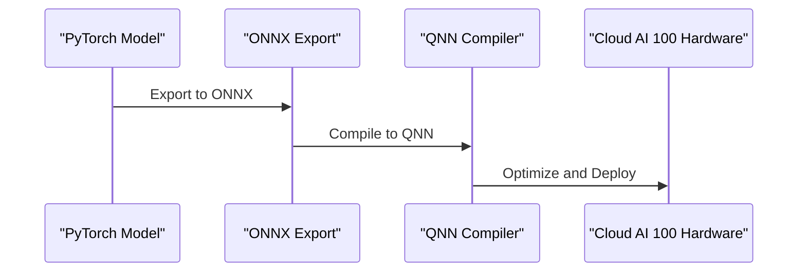
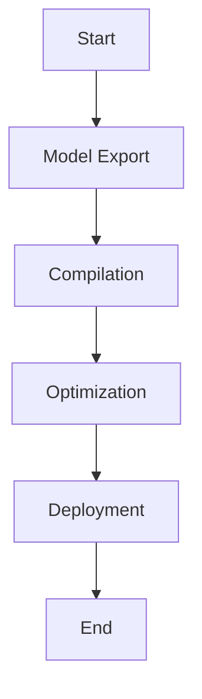

# Compilation Pipeline
## Overview
The compilation pipeline is a critical component of the QEfficient framework, responsible for converting PyTorch models into QNN-compatible binaries for deployment on Cloud AI 100 hardware. This process involves several key steps, including model export, compilation, and optimization. The compilation pipeline is designed to work seamlessly with the QEfficient framework, providing a streamlined process for deploying PyTorch models on Cloud AI 100 hardware.

The compilation pipeline is a complex process that requires careful consideration of several factors, including model architecture, compilation options, and optimization techniques. The pipeline is designed to be flexible and customizable, allowing users to tailor the compilation process to their specific needs. In this section, we will provide a detailed overview of the compilation pipeline, including its key components, concepts, and how it works.

## Key Components / Concepts
The compilation pipeline relies on several key components and concepts, including:
* **ONNX Export**: The process of exporting PyTorch models to the ONNX format, which serves as an intermediate representation for compilation. ONNX is an open standard for representing machine learning models, allowing for seamless integration with a wide range of frameworks and platforms.
* **QNN Compiler**: A compiler specifically designed for Cloud AI 100 hardware, responsible for converting ONNX models into QNN-compatible binaries. The QNN compiler is optimized for performance and efficiency, providing fast and accurate compilation of PyTorch models.
* **Compilation Options**: Various parameters and settings that control the compilation process, such as batch size, sequence length, and precision. These options allow users to customize the compilation process to their specific needs, optimizing performance and efficiency for their particular use case.
* **Optimization Techniques**: Various techniques used to optimize the compiled binary for deployment on Cloud AI 100 hardware, such as tensor slicing and MXFP6 precision. These techniques are designed to improve performance and reduce latency, providing fast and efficient execution of PyTorch models on Cloud AI 100 hardware.

## How it Works
The compilation pipeline works as follows:
1. **Model Export**: The PyTorch model is exported to the ONNX format using the `onnx_path` parameter. This step involves converting the PyTorch model into an ONNX model, which serves as an intermediate representation for compilation.
2. **Compilation**: The ONNX model is compiled into a QNN-compatible binary using the QNN compiler, with options specified in the `qnn_config` parameter. This step involves converting the ONNX model into a QNN-compatible binary, which can be executed on Cloud AI 100 hardware.
3. **Optimization**: The compiled binary is optimized for deployment on Cloud AI 100 hardware, using techniques such as tensor slicing and MXFP6 precision. This step involves applying various optimization techniques to the compiled binary, improving performance and reducing latency.

The compilation pipeline is designed to be flexible and customizable, allowing users to tailor the compilation process to their specific needs. Users can customize the compilation options, optimization techniques, and other parameters to optimize performance and efficiency for their particular use case.

## Example(s)
An example of compiling a PyTorch model using the QEfficient compilation pipeline can be seen in the `compile_kv_model_on_cloud_ai_100` function:
```python
def compile_kv_model_on_cloud_ai_100(
    onnx_path: str,
    specializations_json: str,
    num_cores: int,
    base_path: str,
    mxfp6: bool,
    custom_io_path: str,
    aic_enable_depth_first: bool,
    allow_mxint8_mdp_io: bool,
    mos: int = -1,
    device_group: Optional[List[int]] = None,
    **kwargs,
) -> Tuple[bool, str]:
    # ...
```
This function takes in various parameters, including the ONNX model path, compilation specializations, and device group, and returns a tuple containing a boolean indicating compilation success and the path to the generated QPC binary directory.

Another example of compiling a PyTorch model using the QEfficient compilation pipeline can be seen in the `compile_transformer_model_on_cloud_ai_100` function:
```python
def compile_transformer_model_on_cloud_ai_100(
    onnx_path: str,
    specializations_json: str,
    num_cores: int,
    base_path: str,
    mxfp6: bool,
    custom_io_path: str,
    aic_enable_depth_first: bool,
    allow_mxint8_mdp_io: bool,
    mos: int = -1,
    device_group: Optional[List[int]] = None,
    **kwargs,
) -> Tuple[bool, str]:
    # ...
```
This function takes in various parameters, including the ONNX model path, compilation specializations, and device group, and returns a tuple containing a boolean indicating compilation success and the path to the generated QPC binary directory.

## Diagram(s)

This sequence diagram illustrates the compilation pipeline, showing the export of the PyTorch model to ONNX, compilation to QNN, and optimization and deployment on Cloud AI 100 hardware.


This flowchart illustrates the compilation pipeline, showing the various stages involved in compiling a PyTorch model for deployment on Cloud AI 100 hardware.

## References
* `QEfficient/compile/compile_helper.py`
* `QEfficient/compile/qnn_compiler.py`
* `QEfficient/cloud/execute.py`
* `QEfficient/transformers/models/modeling_auto.py`
* `QEfficient/transformers/models/modeling_utils.py`