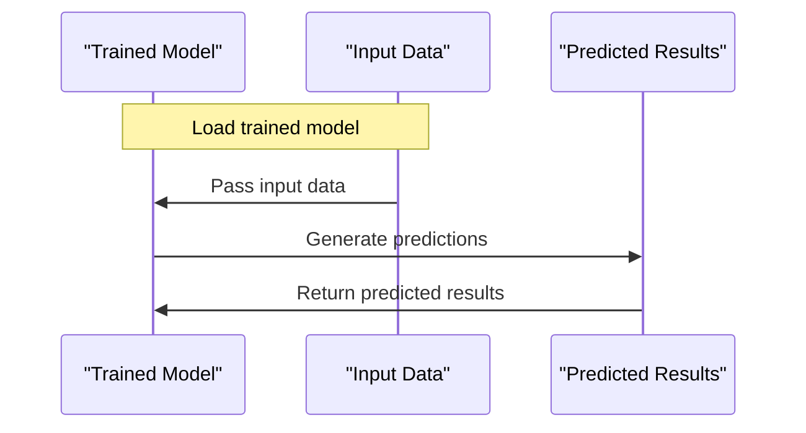

# Model Inference
## Overview
Model inference is the process of using a trained model to make predictions on new, unseen data. In the context of QEfficient, model inference can be performed using different models, including PyTorch, ONNX, and Cloud AI 100.

## Key Components / Concepts
The key components involved in model inference are:
* **Model**: The trained model used for inference.
* **Input data**: The new data used to make predictions.
* **Output**: The predicted results.

## How it Works
The model inference process works as follows:
1. Load the trained model.
2. Prepare the input data.
3. Pass the input data through the model to generate predictions.
4. Return the predicted results.

## Example(s)
For example, the `test_infer_qnn` function tests the inference of a model in a QNN environment without using the full batch size.

## Diagram(s)

Caption: Model Inference Sequence Diagram

## References
* `tests/cloud/test_infer.py`
* `tests/transformers/models/test_causal_lm_models.py`
* `QEfficient/transformers/models/llava_next/modeling_llava_next.py`