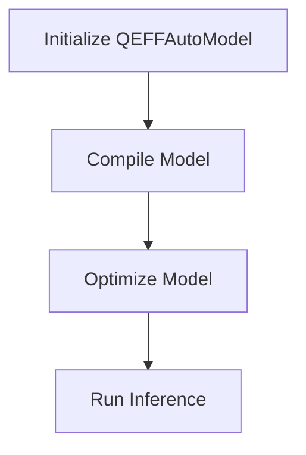

# Introduction to Efficient Transformers
The Efficient Transformers library is a collection of tools and models designed to improve the efficiency and performance of transformer models, with a focus on large-scale language models and vision-language models.

## Overview
The library provides support for various transformer models, including Llama4, Gemma3, and HP-CAI Grok-1, among others. It enables efficient inference and compilation of these models, with features such as sentence embedding, flexible pooling configuration, and support for multiple sequence lengths.

## Key Components / Concepts
The library includes several key components, including:
* QEFFAutoModel: a class for manipulating any transformer model from the Hugging Face hub
* QEFFTransformersBase: a parent class for models provided by QEFF
* transform_lm: a function for replacing certain layers in a PyTorch model with optimized modules for Cloud AI 100

## How it Works
The library works by providing a set of tools and models that can be used to improve the efficiency and performance of transformer models. This includes features such as quantization, compilation, and optimization of linear layers.

## Example(s)
An example of how to use the library is to initialize a QEFFAutoModel using the from_pretrained method, and then compile the model for Cloud AI 100 using the compile method.

## Diagram(s)

This diagram shows the basic workflow of the library, from initializing a QEFFAutoModel to running inference on the optimized model.

## References
* [README.md](README.md)
* [pyproject.toml](pyproject.toml)
* [QEfficient/transformers/models/modeling_auto.py](QEfficient/transformers/models/modeling_auto.py)
* [QEfficient/peft/pytorch_transforms.py](QEfficient/peft/pytorch_transforms.py)
* [QEfficient/transformers/transform.py](QEfficient/transformers/transform.py)