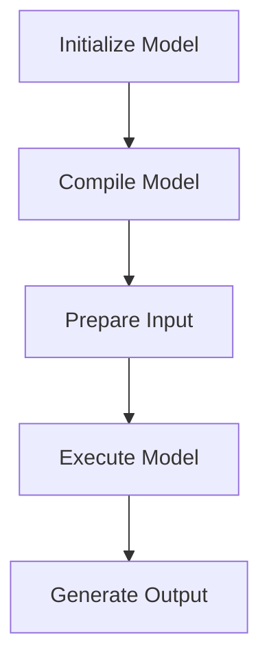

# Python API Reference
The Efficient Transformers library provides a Python API for efficient inference and compilation of transformer models. This reference guide covers the key components and concepts of the API.

## Overview
The API is designed to be similar to the Hugging Face Transformers library, with additional features and optimizations for efficient inference on Qualcomm Cloud AI 100.

## Key Components / Concepts
The API consists of the following key components:

* `QEFFAutoModel`: A class for manipulating transformer models from the Hugging Face hub.
* `QEFFTransformersBase`: A parent class for models provided by QEFF.
* `transform_lm`: A function for replacing certain layers in a PyTorch model with optimized modules for Cloud AI 100.

## How it Works
The API works by initializing a QEfficient model from a pre-trained model, and then using methods such as `compile` and `generate` to perform tasks such as compilation and generation.

## Example(s)
```python
from QEfficient import QEFFAutoModel
from transformers import AutoTokenizer

# Initialize the model using from_pretrained similar to transformers.AutoModel.
model = QEFFAutoModel.from_pretrained("model_name")

# Now you can directly compile the model for Cloud AI 100
model.compile(num_cores=16)  # Considering you have a Cloud AI 100 SKU

# Prepare input
tokenizer = AutoTokenizer.from_pretrained(model_name)
inputs = tokenizer("My name is", return_tensors="pt")

# You can now execute the model
model.generate(inputs)
```

## Diagram(s)

Caption: Flowchart of the QEfficient API workflow.

## References
* `QEfficient/transformers/models/modeling_auto.py`
* `tests/transformers/test_transformer_pytorch_transforms.py`
* `QEfficient/transformers/transform.py`
* `pyproject.toml`