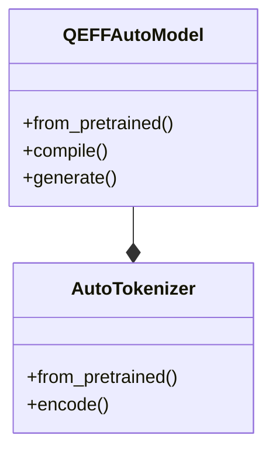

# Model Reference
## Overview
The Efficient Transformers library supports a wide range of transformer models, including Llama4, Gemma3, and HP-CAI Grok-1. This page provides a reference guide to the models supported by the library.

## Key Components / Concepts
The library provides several key components and concepts for working with transformer models, including:
* `QEFFAutoModel`: a class for manipulating transformer models from the HuggingFace hub
* `from_pretrained`: a function for loading models supported by transformers.AutoModelForImageTextToText for Cloud AI 100
* `get_onnx_dynamic_axes`: a function for generating dynamic axes for ONNX models

## How it Works
The library works by providing a set of functions and classes that can be used to load, manipulate, and execute transformer models. The `QEFFAutoModel` class, for example, can be used to load a model from the HuggingFace hub and compile it for Cloud AI 100.

## Example(s)
Here is an example of how to use the `QEFFAutoModel` class to load a model and compile it for Cloud AI 100:
```python
from QEfficient import QEFFAutoModel
from transformers import AutoTokenizer

# Initialize the model using from_pretrained
model = QEFFAutoModel.from_pretrained("model_name")

# Compile the model for Cloud AI 100
model.compile(num_cores=16)

# Prepare input
tokenizer = AutoTokenizer.from_pretrained("model_name")
inputs = tokenizer("My name is", return_tensors="pt")

# Execute the model
model.generate(inputs)
```

## Diagram(s)

Caption: Class diagram showing the relationship between `QEFFAutoModel` and `AutoTokenizer`.

## References
* `tests/transformers/models/test_causal_lm_models.py`
* `QEfficient/transformers/models/modeling_auto.py`
* `tests/cloud/test_infer.py`
* `QEfficient/utils/run_utils.py`