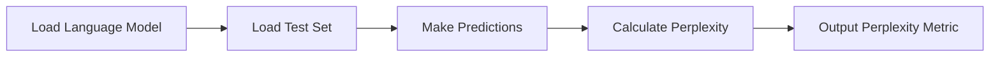

# Perplexity Computation
## Overview
Perplexity computation is a crucial aspect of evaluating the performance of language models. It measures how well a model can predict a test set, given the model was trained on a training set.

## Key Components / Concepts
The key components involved in perplexity computation include:
- **Language Model**: A statistical model that predicts the next word in a sequence, given the context of the previous words.
- **Test Set**: A dataset used to evaluate the performance of the language model.
- **Perplexity Metric**: A measure of how well the model predicts the test set.

## How it Works
The perplexity computation script works by:
1. Loading the language model and test set.
2. Using the model to predict the next word in each sequence of the test set.
3. Calculating the perplexity metric based on the predictions.

## Example(s)
An example of perplexity computation can be seen in the `calculate_perplexity.py` script, which takes a language model and test set as input and outputs the perplexity metric.

## Diagram(s)

Perplexity Computation Flowchart

## References
- `scripts/perplexity_computation/__init__.py`
- `scripts/perplexity_computation/calculate_perplexity.py`
- `tests/transformers/models/test_causal_lm_models.py`