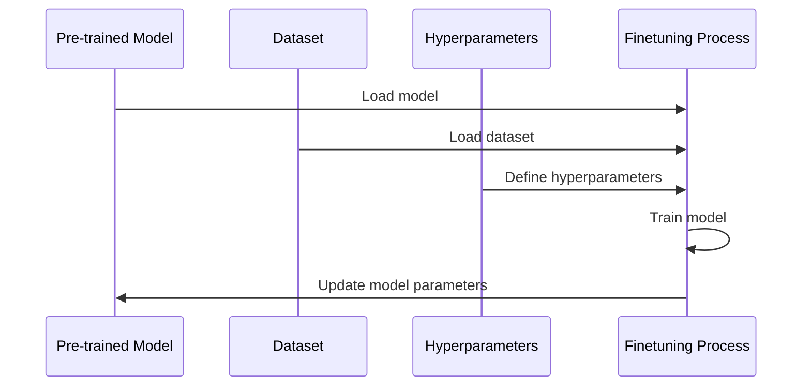

# Finetuning Models
## Overview
Finetuning is a crucial step in adapting pre-trained models to specific tasks or datasets. It involves adjusting the model's parameters to fit the new data, resulting in improved performance.

## Key Components / Concepts
The finetuning process typically involves the following key components:
* Pre-trained model: The initial model that has been trained on a large dataset.
* Dataset: The specific dataset used for finetuning.
* Hyperparameters: Parameters that control the finetuning process, such as learning rate and batch size.

## How it Works
The finetuning process works as follows:
1. Load the pre-trained model and dataset.
2. Prepare the dataset for finetuning by preprocessing and formatting the data.
3. Define the hyperparameters for the finetuning process.
4. Train the model on the dataset using the defined hyperparameters.

## Example(s)
An example of finetuning a model can be seen in the `scripts/finetune/run_ft_model.py` file.

## Diagram(s)

## References
* `scripts/finetune/__init__.py`
* `scripts/finetune/run_ft_model.py`
* `tests/transformers/models/test_causal_lm_models.py`
* `QEfficient/transformers/models/llava_next/modeling_llava_next.py`