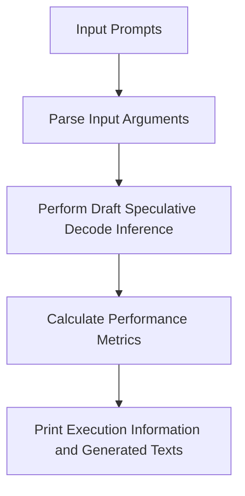

# Repository Scripts Overview
## Overview
The repository scripts package is a collection of utility scripts designed to support the Efficient-Transformers project. The primary purpose of these scripts is to provide a set of tools for tasks such as semantic search, inference, and performance metrics calculation. The package is organized into several subdirectories, each containing scripts and modules specific to a particular task or functionality.

## Key Components / Concepts
The repository scripts package consists of several key components, including:
* `draft_spd_inference.py`: a script for performing draft speculative decode inference on given prompts for semantic search.
* `pld_spd_inference.py`: a script for performing semantic search using natural language processing models.
* `multiprojs_spd_inference.py`: a script for performing semantic search and inference using the QEfficient library.
* `CloudAI100ExecInfo` class: a class for holding information about Cloud AI 100 execution, including prompts, batch size, generated texts, and performance metrics.
* `SpDPerfMetrics` class: a class for holding performance metrics, including average and total batch throughput, decode throughput, and end-to-end throughput.

## How it Works
The scripts in the repository package work by utilizing the QEfficient library and its associated models, such as `QEFFAutoModelForCausalLM`. The scripts take in input arguments, such as prompts and model parameters, and output execution information, including generated texts and performance metrics. The `draft_spd_inference.py` script, for example, performs draft speculative decode inference on given prompts, while the `pld_spd_inference.py` script performs semantic search using natural language processing models.

## Example(s)
An example of using the `draft_spd_inference.py` script can be seen in the following code:
```python
def main():
    args = arg_parse()
    if args.prompts is None:
        args.prompts = Constants.INPUT_STR
    exec_info = draft_spec_decode_inference(**vars(args))
    print(exec_info)
    prompts = exec_info.prompts
    generated_texts = exec_info.generated_texts
    for prompt, generation in zip(prompts, generated_texts):
        print(f"{prompt=} {generation=}")
```
This code parses input arguments, performs draft speculative decode inference, and prints the execution information and generated texts.

## Diagram(s)

This flowchart illustrates the process of performing draft speculative decode inference using the `draft_spd_inference.py` script.

## References
* `docs/index.rst`: the documentation master file for Efficient-Transformers, providing a table of contents for various sections of the documentation.
* `examples/draft_spd_inference.py`: a script for performing draft speculative decode inference on given prompts for semantic search.
* `examples/pld_spd_inference.py`: a script for performing semantic search using natural language processing models.
* `examples/multiprojs_spd_inference.py`: a script for performing semantic search and inference using the QEfficient library.