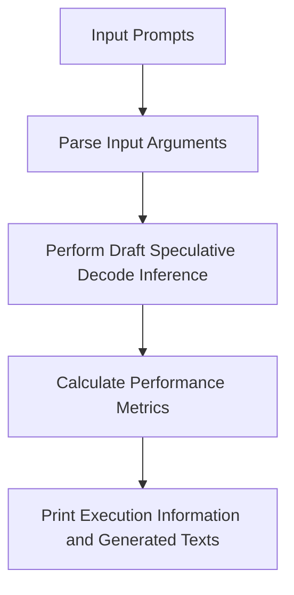
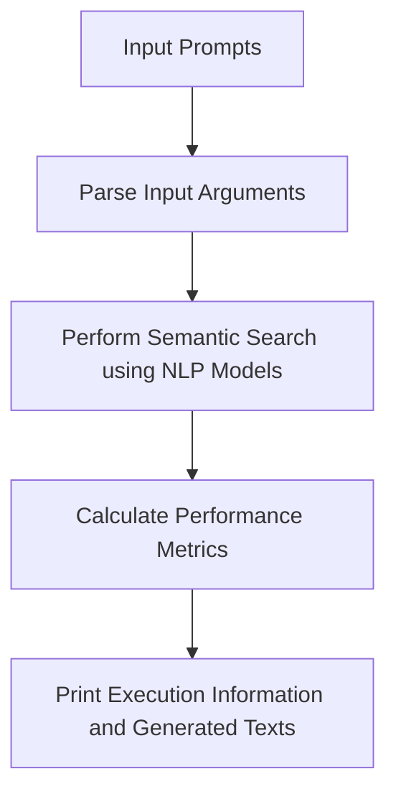
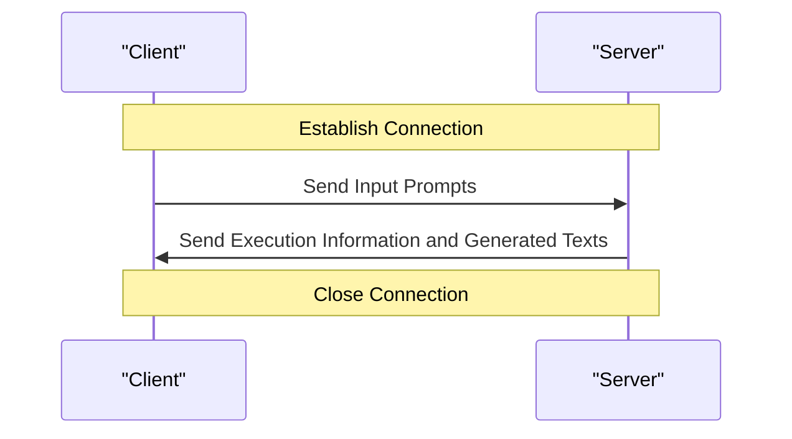

# Repository Scripts Overview
## Overview
The repository scripts package is a comprehensive collection of utility scripts designed to support the Efficient-Transformers project. The primary purpose of these scripts is to provide a set of tools for tasks such as semantic search, inference, and performance metrics calculation. The package is organized into several subdirectories, each containing scripts and modules specific to a particular task or functionality. This organization enables efficient management and maintenance of the scripts, making it easier for developers to locate and utilize the necessary tools for their specific use cases.

The repository scripts package is built on top of the QEfficient library, which provides a foundation for efficient and scalable natural language processing. The scripts leverage the QEfficient library's capabilities to perform tasks such as draft speculative decode inference, semantic search, and performance metrics calculation. By utilizing the QEfficient library, the repository scripts package is able to provide a robust and efficient set of tools for supporting the Efficient-Transformers project.

## Key Components / Concepts
The repository scripts package consists of several key components, including:
* `draft_spd_inference.py`: a script for performing draft speculative decode inference on given prompts for semantic search. This script is designed to take in input prompts and output generated texts, along with performance metrics such as average and total batch throughput.
* `pld_spd_inference.py`: a script for performing semantic search using natural language processing models. This script utilizes the QEfficient library's capabilities to perform semantic search and inference.
* `multiprojs_spd_inference.py`: a script for performing semantic search and inference using the QEfficient library. This script is designed to take in input prompts and output generated texts, along with performance metrics such as average and total batch throughput.
* `CloudAI100ExecInfo` class: a class for holding information about Cloud AI 100 execution, including prompts, batch size, generated texts, and performance metrics. This class provides a structured way of storing and accessing execution information, making it easier to manage and analyze the results of semantic search and inference tasks.
* `SpDPerfMetrics` class: a class for holding performance metrics, including average and total batch throughput, decode throughput, and end-to-end throughput. This class provides a structured way of storing and accessing performance metrics, making it easier to analyze and optimize the performance of semantic search and inference tasks.

## How it Works
The scripts in the repository package work by utilizing the QEfficient library and its associated models, such as `QEFFAutoModelForCausalLM`. The scripts take in input arguments, such as prompts and model parameters, and output execution information, including generated texts and performance metrics. The `draft_spd_inference.py` script, for example, performs draft speculative decode inference on given prompts, while the `pld_spd_inference.py` script performs semantic search using natural language processing models.

The process of performing semantic search and inference using the repository scripts package involves several steps. First, the input prompts are parsed and processed to extract the necessary information. Next, the QEfficient library is utilized to perform the semantic search and inference tasks. Finally, the generated texts and performance metrics are output and stored for further analysis.

The `CloudAI100ExecInfo` and `SpDPerfMetrics` classes play a crucial role in the process of performing semantic search and inference. These classes provide a structured way of storing and accessing execution information and performance metrics, making it easier to manage and analyze the results of semantic search and inference tasks.

## Example(s)
An example of using the `draft_spd_inference.py` script can be seen in the following code:
```python
def main():
    args = arg_parse()
    if args.prompts is None:
        args.prompts = Constants.INPUT_STR
    exec_info = draft_spec_decode_inference(**vars(args))
    print(exec_info)
    prompts = exec_info.prompts
    generated_texts = exec_info.generated_texts
    for prompt, generation in zip(prompts, generated_texts):
        print(f"{prompt=} {generation=}")
```
This code parses input arguments, performs draft speculative decode inference, and prints the execution information and generated texts.

Another example of using the `pld_spd_inference.py` script can be seen in the following code:
```python
def main():
    args = arg_parse()
    if args.prompts is None:
        args.prompts = Constants.INPUT_STR
    exec_info = pld_spec_decode_inference(**vars(args))
    print(exec_info)
    prompts = exec_info.prompts
    generated_texts = exec_info.generated_texts
    for prompt, generation in zip(prompts, generated_texts):
        print(f"{prompt=} {generation=}")
```
This code parses input arguments, performs semantic search using natural language processing models, and prints the execution information and generated texts.

## Diagram(s)

This flowchart illustrates the process of performing draft speculative decode inference using the `draft_spd_inference.py` script.


This flowchart illustrates the process of performing semantic search using natural language processing models using the `pld_spd_inference.py` script.


This sequence diagram illustrates the process of performing semantic search and inference using the repository scripts package in a client-server architecture.

## References
* `docs/index.rst`: the documentation master file for Efficient-Transformers, providing a table of contents for various sections of the documentation.
* `examples/draft_spd_inference.py`: a script for performing draft speculative decode inference on given prompts for semantic search.
* `examples/pld_spd_inference.py`: a script for performing semantic search using natural language processing models.
* `examples/multiprojs_spd_inference.py`: a script for performing semantic search and inference using the QEfficient library.
* `src/qefficient/models.py`: a module containing the implementation of the QEfficient library's models, including `QEFFAutoModelForCausalLM`.