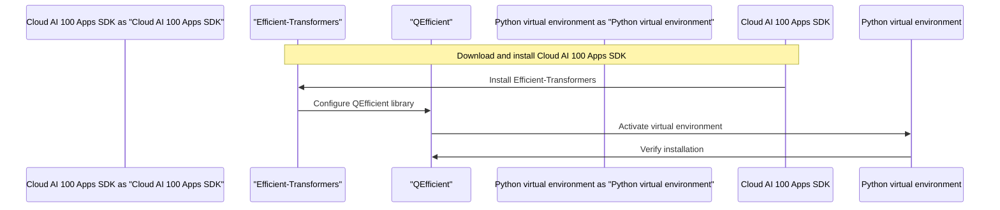

# Installation and Setup Guide
## Overview
The QEfficient library is designed to work seamlessly with the Cloud AI 100 Apps SDK, providing efficient transformers for a wide range of tasks, including but not limited to, natural language processing, computer vision, and speech recognition. To get started with the QEfficient library, it is essential to install the required dependencies and set up the environment correctly. This comprehensive guide will walk you through the step-by-step process of installing the library, building optional components, and configuring the runtime environment. The installation process involves several critical steps that must be followed carefully to ensure a successful setup.

## Key Components / Concepts
Before diving into the installation process, it is crucial to understand the key components involved in the QEfficient library:
* **Cloud AI 100 Apps SDK**: This is the primary dependency required for QEfficient to function. The Cloud AI 100 Apps SDK provides a set of tools and APIs that enable developers to build, deploy, and manage AI applications on various platforms.
* **Efficient-Transformers**: This library provides optimized transformer models for various tasks, including text classification, sentiment analysis, and language translation. The Efficient-Transformers library is designed to work with the Cloud AI 100 Apps SDK, providing a seamless integration of AI capabilities into applications.
* **Python virtual environment**: This is used to isolate the dependencies and ensure a clean installation. A Python virtual environment is a self-contained Python environment that allows developers to manage dependencies and packages without affecting the system-wide Python installation.
* **QEfficient library**: This library provides a set of APIs and tools that enable developers to build and deploy efficient transformer-based applications. The QEfficient library is designed to work with the Cloud AI 100 Apps SDK and the Efficient-Transformers library, providing a comprehensive solution for building AI applications.

## How it Works
The installation process involves the following steps:
1. **Download and install the Cloud AI 100 Apps SDK**: This step involves downloading the Cloud AI 100 Apps SDK from the official repository and installing it on the system. The installation process may vary depending on the operating system and platform.
2. **Uninstall any existing versions of the Apps SDK**: This step involves uninstalling any existing versions of the Cloud AI 100 Apps SDK to ensure a clean installation.
3. **Install Efficient-Transformers using a Python virtual environment**: This step involves creating a Python virtual environment and installing the Efficient-Transformers library using pip.
4. **Activate the virtual environment**: This step involves activating the Python virtual environment to ensure that the dependencies are correctly configured.
5. **Verify the installation**: This step involves verifying that the QEfficient library and the Efficient-Transformers library are correctly installed and configured.

## Example(s)
To illustrate the installation process, let's consider an example:
```bash
# Download and install the Cloud AI 100 Apps SDK
sudo ./install.sh --enable-qeff

# Create a Python virtual environment
python -m venv qeff-env

# Activate the virtual environment
source qeff-env/bin/activate

# Install Efficient-Transformers
pip install efficient-transformers

# Verify the installation
python -c "import qefficient; print(qefficient.__version__)"
```
This example demonstrates the installation process on a Linux-based system. The installation process may vary depending on the operating system and platform.

## Diagram(s)

Caption: Installation flowchart


Caption: Sequence diagram

## References
* [docs/source/installation.md](docs/source/installation.md)
* [QEfficient/__init__.py](QEfficient/__init__.py)
* [docs/README.md](docs/README.md)
* [examples/pld_spd_inference.py](examples/pld_spd_inference.py)
* [QEfficient/utils/_utils.py](QEfficient/utils/_utils.py)